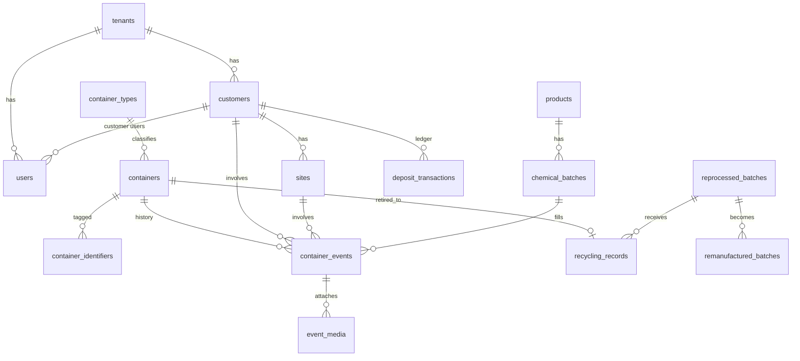
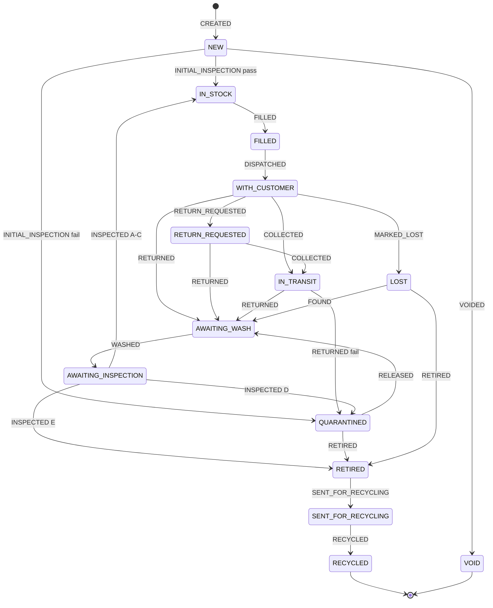

# Clariq Circular Container Platform - Architecture

**Version:** 0.2 (approved for build); build notes through 30 August 2026 in the decision log
**Date:** 24 August 2026
**Status:** Approved - Stage 0 may begin
**Owner:** Clariq

**Changes in 0.2:** ISO 59000 series alignment (new section 10.6, dashboard restructure in section 13, report methodology rules, schema additions in 8.1 and 8.5, value-retention mapping in 9.2); logo received; decision log and open items updated.

This document is the single source of truth for how the platform is built. It is updated at the end of every build session. Anything not in here does not exist.

---

## 1. Purpose and principles

Every physical container has one permanent digital identity, and every significant event in its life is recorded against that identity.

The platform is a mobile-first Progressive Web App (PWA) backed by Supabase. There is no spreadsheet phase. The original brief's Google Sheets V1 and Phase 2 migration are superseded; the "Phase 2" architecture is built first, with V1 scope discipline.

Design principles, in priority order:

1. **Data discipline over features.** Append-only history, controlled vocabularies, no free text where a list will do.
2. **Scan → choose action → minimum fields → submit.** A container action takes under 30 seconds on a phone in a shed.
3. **Stunning and intuitive.** Any screen a customer or non-technical owner sees must be understandable without instruction.
4. **Owned and transferable.** Every account, key and domain belongs to Clariq. A new owner picks it up from `Handover.md`.
5. **Grows without rebuild.** Tenancy, roles, identifiers and integrations are structurally present from day one even where unused.

---

## 2. Stack and hosting

| Layer | Choice | Reason |
|---|---|---|
| Database, auth, storage, edge functions | Supabase (Postgres) | Row-level security, built-in auth (magic link, passkey), object storage for media, SQL export. Clariq-owned project. |
| Front end | React + TypeScript + Vite, PWA (installable, offline shell) | Static build, no server rendering needed. |
| Styling | Tailwind CSS with a Clariq design-token layer | Tokens (colour, type, spacing) live in one file for rebranding. |
| Hosting / CDN | Netlify | Static PWA; Netlify and Vercel are equivalent for this build. Known over unknown. |
| Domain | `app.clariq.nz` | CNAME to Netlify. Marketing site untouched. |
| Email | Resend (magic links, digests) | Clariq-owned account, sending domain `clariq.nz` verified. |
| QR generation | Client-side (`qrcode` library) + PDF label sheet | No external service dependency. |
| QR scanning | Native phone camera (URL) and in-app scanner (`BarcodeDetector` with library fallback) | No app store, no hardware. |

**Why not Vercel:** for a static PWA with no server-side rendering, the two are functionally identical. Netlify is chosen because the owner already operates it. Nothing in the build is Netlify-specific; the `dist` folder deploys anywhere.

**Accounts to be created under Clariq before build starts:** Supabase organisation and project (Sydney region), Netlify team, Resend account, GitHub organisation and repository. Greg is a collaborator on each, not the owner.

---

## 3. Tenancy

The platform is single-tenant at launch (Clariq) but every business table carries `tenant_id`. One row exists in `tenants`. Row-level security policies filter on `tenant_id` from day one, so enabling a second tenant later is a data change, not a code change.

Hierarchy:

```
Platform Owner (Clariq)
└── Tenant: Clariq Operations
    ├── Staff users (roles below)
    ├── Customers (e.g. ABC Ltd)
    │   ├── Sites
    │   └── Customer users (read-only, own data)
    ├── Containers, Products, Batches, Deposits, Recycling records
    └── Settings (overdue thresholds, methodology factors, label text)
```

---

## 4. Roles and permissions

Roles are a lookup table. Permissions are boolean flags on the role, plus per-user overrides. Launch uses two roles; the others are defined and dormant.

| Permission | Admin | Warehouse Operator | Inspector | Driver | Sales / Account | Customer |
|---|---|---|---|---|---|---|
| View all containers | ✔ | ✔ | ✔ | ✔ | ✔ | own only |
| Create containers / print labels | ✔ | ✔ | | | | |
| Fill, dispatch | ✔ | ✔ | | | | |
| Record collected / delivered | ✔ | ✔ | | ✔ | | |
| Record returned + quick visual | ✔ | ✔ | ✔ | ✔ | | |
| Wash | ✔ | ✔ | | | | |
| Full inspection | ✔ | ✔ | ✔ | | | |
| Release from quarantine / retire (`can_authorise`) | ✔ | flag | flag | | | |
| Admin override (adjustment event) | ✔ | | | | | |
| Manage customers, sites, products, batches | ✔ | | | | ✔ | |
| Deposits ledger | ✔ | | | | ✔ | |
| Recycling records | ✔ | ✔ | | | | |
| Reports and dashboard | ✔ | ✔ | ✔ | ✔ | ✔ | own only |
| Settings, users, roles | ✔ | | | | | |
| Export data | ✔ | | | | ✔ | own only |

`can_authorise` is a per-user flag. Admin always has it. Any other role may be granted it individually.

---

## 5. Authentication

| Who | Method | Session |
|---|---|---|
| Platform Admin | Passkey (WebAuthn). Fallback email + TOTP if passkey support is not production-ready in Supabase at build time - confirmed before first login. | 12 hours, re-auth for settings and user management. |
| Staff | Magic link by email. | 30 days on the device. Devices are personal, not shared. |
| Customer | Magic link by email. | 30 days. |
| Public (unauthenticated scan) | None. | Sees the public container page only (section 7). |

Every action is attributed to `auth.uid()`. There is no "who are you" step because devices are singular. If shared devices are introduced later, a PIN-per-action layer can be added without schema change.

---

## 6. Identifiers

All IDs are generated by the database, never by the client.

| Entity | Format | Rule |
|---|---|---|
| Container | `CLQ-000127` | Strictly sequential from a Postgres sequence. Never reused. |
| Voided container | same ID, status `VOID` | Reason mandatory. Sequence is not rewound. Voided IDs appear in audit and export. |
| Customer | `CUS-0001` | Sequential. |
| Site | `SITE-0001` | Sequential, global (not per customer). |
| Container type | `TYPE-5L-HDPE-01` | Human-assigned, validated unique. |
| Product | `PRD-0001` | Sequential. |
| Chemical batch | `EXT-260824-A` | Supplied by Clariq at batch receipt; format validated but not generated. Format to be confirmed. |
| Event | `EVT-00000001` | Sequential. |
| Deposit transaction | `DEP-00000001` | Sequential. |
| Recycling record | `REC-2026-004` | Year + sequence. |
| Reprocessed batch | `PCR-2026-007` | Year + sequence. |
| Remanufactured product batch | `RMP-2026-001` | Year + sequence. |

**Secondary identifiers.** `container_identifiers` holds any number of tags per container: `QR`, `RFID`, `NFC`, `BARCODE`. The QR is inserted at creation as `QR-CLQ-000127`. Adding RFID later is an insert, not a schema change.

---

## 7. QR and redirect layer

The label encodes `https://app.clariq.nz/c/CLQ-000127`. Nothing else.

The `/c/:id` route is handled by the app:

| Visitor | Sees |
|---|---|
| Not logged in | Container ID, "Property of Clariq - please return", return instructions, "Staff login" link. No product, batch or customer. |
| Customer user, container is theirs | ID, product name, SDS link, cycles completed, request collection button (Phase 2). |
| Customer user, container is not theirs | Same as not logged in. |
| Staff | Full container card and the action list for its current status. |

A `redirects` table (`path`, `destination`, `active`) sits in front of this so a future owner can point labels elsewhere without reprinting. Default: no redirect, app handles it.

---

## 8. Data model

Every business table has: `id`, `tenant_id`, `created_at`, `created_by`, `updated_at`, `updated_by`. Soft-delete via `archived_at` where deletion is ever appropriate; never on events.

### 8.1 Master data

- **tenants** - `name`, `settings` (JSON: overdue thresholds, methodology factors, label text)
- **users** - mirrors `auth.users`; `role_id`, `can_authorise`, `customer_id` (null for staff), `display_name`, `active`
- **roles** - `code`, `name`, permission flags
- **container_types** - `code`, `capacity_litres`, `material`, `empty_weight_g`, `recycled_content_pct`, `renewable_content_pct`, `replacement_cost`, `manufacturer`, `model`, `closure_type`, `design_life_cycles`, `compatible_product_groups[]`, `active`. The two content percentages are supplied by the container manufacturer and feed the ISO 59020 resource-inflow indicators (section 10.6); null until known, never guessed.
- **customers** - `code`, `legal_name`, `trading_name`, `primary_contact`, `email`, `phone`, `billing_details` (JSON), `account_status`, `return_arrangement`, `deposit_arrangement` (`PER_CONTAINER` \| `ACCOUNT` \| `NONE`), `xero_contact_ref`, `notes`
- **sites** - `code`, `customer_id`, `name`, `address` (structured), `region`, `contact`, `phone`, `delivery_instructions`, `collection_instructions`, `active`
- **products** - `code`, `name`, `product_group`, `manufacturer`, `concentration`, `sds_url`, `tech_info_url`, `compatibility_notes`, `active`
- **chemical_batches** - `code`, `product_id`, `supplier`, `supplier_lot`, `production_date`, `received_date`, `opened_date`, `quantity_received`, `quantity_remaining`, `expiry_date`, `notes`
- **reference_lists** - `list` (`RETIREMENT_REASON`, `QUARANTINE_REASON`, `WASH_METHOD`, `CONDITION_GRADE`, `RECYCLER`, `REMANUFACTURED_PRODUCT`…), `code`, `label`, `sort`, `active`. All dropdowns read from here; Admin edits them.

### 8.2 Containers (current state)

**containers** - `code`, `container_type_id`, `supplier`, `supplier_ref`, `purchase_date`, `purchase_cost` (defaults from type, editable), `commissioning_date`, `status`, `location` (`WAREHOUSE` \| `CUSTOMER_SITE` \| `IN_TRANSIT` \| `RECYCLER` \| `UNKNOWN`), `current_customer_id`, `current_site_id`, `current_product_id`, `current_batch_id`, `current_order_ref`, `fill_count`, `return_count`, `completed_cycle_count`, `last_fill_at`, `last_dispatch_at`, `expected_return_at`, `last_return_at`, `last_inspection_at`, `last_wash_at`, `condition_grade`, `deposit_value`, `deposit_status`, `retirement_date`, `retirement_reason`, `recycling_record_id`, `void_reason`, `notes`

**This table is never written by the application directly.** Every column other than the purchase/commissioning fields is maintained by a trigger on `container_events`. This guarantees the current state always agrees with history.

**container_identifiers** - `container_id`, `kind`, `value`, `attached_at`, `detached_at`

### 8.3 Events (the permanent record)

**container_events** - `code`, `container_id`, `event_type`, `occurred_at`, `recorded_at`, `actor_id`, `from_status`, `to_status`, `from_location`, `to_location`, `customer_id`, `site_id`, `product_id`, `batch_id`, `order_ref`, `quantity`, `payload` (JSON, event-specific fields - inspection grades, wash method, quick-visual answers, reasons), `notes`, `adjusts_event_id` (for adjustments), `override_reason`

Rules enforced in Postgres:
- `INSERT` only. `UPDATE` and `DELETE` are revoked from every application role including Admin.
- A trigger validates `from_status → to_status` against the transition table (section 9). Invalid transitions are rejected unless `event_type = ADJUSTMENT` and the actor has the admin-override permission and `override_reason` is present.
- A trigger updates `containers` after insert.

**event_media** - `event_id`, `kind` (`PHOTO` \| `VIDEO`), `storage_path`, `size_bytes`, `duration_s`, `caption`. Media is linked to the event, never to the container alone.

### 8.4 Deposits

**deposit_transactions** - `code`, `customer_id`, `container_id` (null for account-level), `kind` (`CHARGED` \| `REFUNDED` \| `FORFEITED` \| `ADJUSTMENT`), `amount`, `occurred_at`, `reason`, `xero_invoice_ref`, `event_id` (the dispatch or return that triggered it), `notes`

Balance is a view, not a stored column. Reconciliation to Xero is a report keyed on `xero_invoice_ref`.

### 8.5 Recycling and remanufacturing

- **recycling_records** - `code`, `container_id`, `material`, `weight_g`, `retired_at`, `retirement_reason`, `sent_at`, `recycler`, `recycler_ref`, `recycler_declaration_ref` (certification or declaration reference held from the recycler), `chain_of_custody_note`, `recycling_batch_ref`, `weight_recovered_g`, `processing_method`, `reprocessed_batch_id`, `notes`. The declaration and chain-of-custody fields support secondary-materials traceability in the sense of ISO 59014.
- **reprocessed_batches** - `code`, `material`, `total_input_weight_g`, `total_output_weight_g`, `processor`, `processed_at`
- **remanufactured_batches** - `code`, `reprocessed_batch_id`, `product_name` (from reference list), `quantity`, `destination`, `manufactured_at`

This gives the chain: container → recycling record → reprocessed batch → remanufactured batch, each a foreign key.

### 8.6 Audit log (master data)

**audit_log** - `table_name`, `row_id`, `action`, `actor_id`, `at`, `old_row` (JSON), `new_row` (JSON)

Populated by a generic trigger on every master-data table. Combined with `container_events`, every change in the system has an actor, a time, a before and an after.

### 8.7 Entity diagram



---

## 9. Container state machine

### 9.1 Reconciled statuses

The brief listed 22 statuses and 21 event types with overlaps. They reconcile to 14 statuses. Original names are mapped so nothing from the brief is lost.

| Status | Meaning | Brief statuses absorbed | Colour group |
|---|---|---|---|
| `NEW` | Created, label printed, not yet inspected | New, Awaiting Initial Inspection | Neutral |
| `IN_STOCK` | Empty, clean, inspected, ready to fill | Approved for Use, In Stock, Washed, Approved for Refill | Ready |
| `FILLED` | Product and batch inside, awaiting dispatch | Filled, Ready for Dispatch | Ready |
| `WITH_CUSTOMER` | Dispatched to a customer site | With Customer | Out |
| `RETURN_REQUESTED` | Customer or staff has requested collection | Return Requested, Return Scheduled | Out |
| `IN_TRANSIT` | Collected, not yet at warehouse | (implied by Collected event) | Out |
| `AWAITING_WASH` | Returned, quick visual passed | Returned, Awaiting Wash | Processing |
| `AWAITING_INSPECTION` | Washed, awaiting full inspection | Awaiting Inspection | Processing |
| `QUARANTINED` | Held pending authorised decision | Quarantined, Damaged | Problem |
| `LOST` | Not returned, written off | Lost | Problem |
| `RETIRED` | Withdrawn from service, awaiting recycling | Retired, Awaiting Recycling | End of life |
| `SENT_FOR_RECYCLING` | Physically with recycler | Sent for Recycling | End of life |
| `RECYCLED` | Material recovered; reprocessing recorded on the recycling record | Recycled, Reprocessed | End of life |
| `VOID` | ID cancelled before use | (new) | End of life |

"Overdue" is not a status. It is a calculated flag on `WITH_CUSTOMER` and `RETURN_REQUESTED` (section 10.2).

### 9.2 Event types and allowed transitions

| Event | From | To | Required fields | Counters |
|---|---|---|---|---|
| `CREATED` | - | `NEW` | type, supplier, purchase date, cost | |
| `VOIDED` | `NEW` | `VOID` | reason | |
| `INITIAL_INSPECTION` | `NEW` | `IN_STOCK` or `QUARANTINED` | grade, pass/fail | |
| `FILLED` | `IN_STOCK` | `FILLED` | product, batch, quantity | fill_count +1 |
| `DISPATCHED` | `FILLED` | `WITH_CUSTOMER` | customer, site, expected return, order ref | |
| `DELIVERED` | `WITH_CUSTOMER` | `WITH_CUSTOMER` | - (driver confirmation, Phase 2) | |
| `RETURN_REQUESTED` | `WITH_CUSTOMER` | `RETURN_REQUESTED` | requested by, preferred date | |
| `COLLECTED` | `WITH_CUSTOMER`, `RETURN_REQUESTED` | `IN_TRANSIT` | site | |
| `RETURNED` | `WITH_CUSTOMER`, `RETURN_REQUESTED`, `IN_TRANSIT` | `AWAITING_WASH` or `QUARANTINED` | quick visual: cap present, residue, contamination, visible damage | return_count +1; completed_cycle +1 if a `DISPATCHED` follows the last `FILLED` |
| `WASHED` | `AWAITING_WASH` | `AWAITING_INSPECTION` | method, operator, outcome | |
| `INSPECTED` | `AWAITING_INSPECTION` | `IN_STOCK` (A–C), `QUARANTINED` (D), `RETIRED` (E) | grade, sub-conditions, QR readable, reason if D/E | |
| `QUARANTINED` | any active status | `QUARANTINED` | reason | |
| `RELEASED` | `QUARANTINED` | `AWAITING_WASH` or `AWAITING_INSPECTION` | `can_authorise`, decision note | |
| `MARKED_LOST` | `WITH_CUSTOMER`, `RETURN_REQUESTED`, `IN_TRANSIT` | `LOST` | reason | |
| `FOUND` | `LOST` | `AWAITING_WASH` | where found | |
| `RETIRED` | `QUARANTINED`, `AWAITING_INSPECTION`, `IN_STOCK`, `LOST` | `RETIRED` | `can_authorise`, reason, est. weight, intended destination | |
| `SENT_FOR_RECYCLING` | `RETIRED` | `SENT_FOR_RECYCLING` | recycler, batch ref, date, weight | |
| `RECYCLED` | `SENT_FOR_RECYCLING` | `RECYCLED` | weight recovered, method, reprocessed batch | |
| `ADJUSTMENT` | any | any | Admin only, override reason, `adjusts_event_id` optional | as specified |
| `NOTE` | any | same | free text, media | |

Everything not in this table is rejected by the database. The mobile action list for a container is generated from this table, so staff only ever see valid actions.

Each event type additionally carries a `value_retention_process` in reference data, mapping operational language to ISO 59004 terms: `WASHED`, `INSPECTED`, `FILLED`, `DISPATCHED`, `RETURNED` → *reuse*; `SENT_FOR_RECYCLING`, `RECYCLED` → *recycling*; remanufactured-batch creation → *remanufacture*. Staff screens keep the operational words; reports and customer-facing screens use the ISO vocabulary.

### 9.3 Diagram



### 9.4 Inspection grades

| Grade | Label | Outcome |
|---|---|---|
| A | Excellent | `IN_STOCK` |
| B | Good | `IN_STOCK` |
| C | Serviceable | `IN_STOCK`, flagged for watch |
| D | Quarantine | `QUARANTINED`, reason mandatory |
| E | Retire | `RETIRED`, reason and estimated weight mandatory, requires `can_authorise` (otherwise lands in `QUARANTINED` pending authorisation) |

---

## 10. Calculations

All calculations are SQL views or generated columns, never client-side, so exports, dashboards and reports agree.

### 10.1 Cycles

- **Fill count** - number of `FILLED` events.
- **Return count** - number of `RETURNED` events.
- **Completed cycle** - a `RETURNED` event preceded (since the last `RETURNED` or creation) by `FILLED` then `DISPATCHED`. A container returned without being filled and dispatched does not count.
- **Days with customer** - `RETURNED.occurred_at − DISPATCHED.occurred_at` per cycle.
- **Average cycle time** - mean of the above, per container, per customer and fleet-wide.

### 10.2 Overdue

Thresholds live in tenant settings; defaults below.

| Flag | Rule | Default |
|---|---|---|
| Not due | today < expected − due_soon_days | |
| Due soon | within `due_soon_days` of expected | 7 days |
| Overdue | past expected by up to `overdue_days` | 14 days |
| Significantly overdue | past expected by more than `overdue_days` | > 14 days |

Days outstanding = today − dispatch date, shown on every out-with-customer container.

### 10.3 Economics

- Capital cost per use = `purchase_cost ÷ completed_cycle_count` (null until first cycle).
- Fleet replacement value = Σ `container_types.replacement_cost` over active containers.
- Lost container value = Σ replacement cost over `LOST`.
- Lifecycle cost per fill (Phase 2) - schema includes a `container_costs` table (`container_id`, `cost_type`, `amount`, `event_id`) so wash, collection, repair and cap costs can be attributed per event later.

### 10.4 Material avoidance (estimated)

Methodology factors in tenant settings, editable by Admin:

- `single_use_equivalent_rule` - default `completed_cycles − 1`
- `single_use_weight_g` - default: container type's `empty_weight_g`
- `emissions_factor_kg_co2e_per_kg` - default null (not shown until set)

Packaging avoided (g) = Σ over containers of `(completed_cycles − 1) × empty_weight_g`, floored at zero.

### 10.5 Measured vs estimated

Every metric carries a `basis` of `MEASURED` or `ESTIMATED`. Estimated metrics render with an "Estimated" badge and a link to the methodology text (Admin-editable). Admin may replace an estimate with a measured value via a `metric_overrides` record; the estimate is retained beside the override with actor and reason, so the substitution is auditable.

### 10.6 ISO 59000 series alignment

The platform aligns its language and measurement structure with the ISO 59000 circular economy family: ISO 59004:2024 (vocabulary and principles), ISO 59020:2024 (measuring and assessing circularity performance), ISO 59014:2024 (traceability of secondary materials recovery) and ISO 59040:2025 (Product Circularity Data Sheet).

**Measurement frame (ISO 59020).** The "system in focus" is the Clariq container fleet, measured over a selectable period. Circularity metrics are grouped as:

| Group | Metrics | Source |
|---|---|---|
| Resource inflows | New containers commissioned in period; recycled content %; renewable content % | `container_types` content fields × commissioned containers |
| Value retention | Fills, completed cycles, return rate, average rotations, average cycle time | Event history (section 10.1) |
| Resource outflows | Mass retired; mass sent to recycler; mass recovered; **recovery rate** = recovered ÷ retired | `recycling_records` weights |
| Losses | Lost containers, count and mass | `LOST` status × type empty weight |

All figures are recomputable for any period from the append-only event history, which is what makes them reproducible and verifiable in the sense the standard requires.

**Claim wording rule (binding).** Reports and marketing copy generated by the platform may state that figures are *"prepared with reference to the measurement framework of ISO 59020:2024"*. The platform must never generate the words "compliant with", "certified to" or "conforms to" any ISO 59000 standard. Conformity is a formal assessment Clariq has not undertaken; a false claim is the greenwashing exposure the series exists to prevent. This rule is enforced in report templates, not left to memory.

**Traceability (ISO 59014).** The container → recycling record → reprocessed batch → remanufactured batch chain, with weights at each step and the recycler declaration reference, provides mass-balance traceability for secondary-material claims.

**Material passport (ISO 59040, Phase 3).** The future passport is structured as PCDS-style True/False circularity statements per container type, backed by the container's event history. A PCDS is not an EU digital product passport; the PCDS data is input to one, no more.

**Glossary.** The app includes a short glossary page mapping Clariq operational terms to ISO 59004 vocabulary, visible to staff and customers.

**Clariq action (outside the build).** Clariq should purchase ISO 59004 and ISO 59020 (via Standards New Zealand) before making public marketing claims referencing them; ISO 59014 and 59040 when Phase 3 approaches.

---

## 11. Media

| | Photo | Video |
|---|---|---|
| Where | Inspection, quarantine, return quick-visual, recycling, any `NOTE` | Same |
| Client processing | Resized to max 1600 px longest edge, JPEG ~80%, target ≤ 500 KB | Capped at 30 seconds, re-encoded on device where the browser supports it |
| Hard limit | 5 MB | 60 MB |
| Storage | Supabase Storage bucket `event-media`, path `tenant/container/event/file` | Same |
| Access | Signed URLs, staff and Admin only. Customers see none in V1. | Same |

Retention: indefinite. Storage cost at expected volumes is negligible; revisit if it is not.

---

## 12. Notifications

V1: one daily email digest to Admin (07:00 NZ time) listing overdue and significantly overdue containers grouped by customer, with counts, longest outstanding and replacement value at risk. Sent by a Supabase scheduled edge function via Resend.

The `notification_rules` table (`trigger`, `channel`, `recipient_role`, `active`) exists from day one with only this rule active, so the triggers in brief section 29 are additions, not a new subsystem.

---

## 13. Dashboard and reports

**Screen 1 - Today.** Overdue view (section 10.2) and fleet counts by status, each status a tappable tile. This is the landing screen for staff.

**Screen 2 - Circularity.** Structured on the ISO 59020 groups in section 10.6, with a period selector (month, quarter, year, all time): resource inflows, value retention, resource outflows, losses, plus packaging avoided (estimated badge). Every figure recalculates for the selected period.

**Screen 3 - Financial.** Fleet cost, replacement value, lost value, deposit balances, cost per use.

**Demo mode (lockstep).** The app ships with a built-in demonstration mode: the same screens and the same gateway interface, backed by a deterministic generated fleet (~120 containers, six customers, realistic overdue spread) instead of Supabase. It activates automatically when no backend is configured and on demand via `?demo=1` after go-live, for sales demonstrations and staff training. Lockstep is structural, not procedural: there is one UI, so every change to the app is a change to the demo. Demo data fabricates *data* only; behaviour always comes from the mirrored transition table, and the database remains authoritative.

**Customer report.** Per customer, date range (month, quarter, year, custom). On-screen and Clariq-branded PDF. Fields as brief section 21, grouped using the ISO vocabulary. Ends with a methodology block: which figures are measured vs estimated, the methodology text, and the fixed sentence *"Prepared with reference to the measurement framework of ISO 59020:2024."* The claim wording rule in section 10.6 applies. Available to the customer's own users.

---

## 14. Design

- **Mobile first.** Every screen designed at 390 px width first, then widened. Staff screens are thumb-reachable; primary action at the bottom.
- **Light and dark**, following device preference, with manual toggle. Light mode tuned for outdoor contrast.
- **Colour-blind safe.** The Admin is colour-blind. Status colours use the Okabe–Ito palette and are never the only signal: every status has an icon and a text label.

| Group | Statuses | Colour | Icon |
|---|---|---|---|
| Ready | `IN_STOCK`, `FILLED` | Bluish green `#009E73` | check-circle |
| Out | `WITH_CUSTOMER`, `RETURN_REQUESTED`, `IN_TRANSIT` | Blue `#0072B2` | truck |
| Processing | `AWAITING_WASH`, `AWAITING_INSPECTION` | Orange `#E69F00` | refresh |
| Overdue (flag) | - | Vermillion `#D55E00` | alert-triangle |
| Problem | `QUARANTINED`, `LOST` | Reddish purple `#CC79A7` | shield-alert |
| End of life | `RETIRED`, `SENT_FOR_RECYCLING`, `RECYCLED`, `VOID` | Grey `#7A7A7A` | archive |
| Neutral | `NEW` | Sky blue `#56B4E9` | plus-circle |

These are functional colours. Brand colours (backgrounds, type, accents) come from the Clariq palette and logo, to be supplied before UI build. Functional colours are checked against the brand for contrast at that point.

- **Typography.** Minimum 16 px body, 18 px on forms. Large tap targets (≥ 48 px).
- **Tone.** Calm, spacious, no clutter. A scan result shows one card and one list of actions.

---

## 15. Export, backup, ownership

- **Export.** Admin: any table to CSV or XLSX from the app. Customer: their own containers and report. Event history export always includes the full payload.
- **Backup.** Supabase daily automated backups (Pro plan, 7-day retention) plus a weekly scheduled edge function writing a full CSV bundle to a Clariq-owned storage bucket. Media bucket included.
- **Recovery.** Documented in `Handover.md` with a tested restore procedure before go-live.
- **Ownership.** All accounts under Clariq. No credentials are ever stored in the repository; they live in Netlify and Supabase environment settings.
- **API.** Supabase exposes a REST and realtime API over the same RLS policies. Future integrations (Xero, Shopify, CRM) use this; no separate API layer is needed.

---

## 16. Build stages

| Stage | Scope | Definition of done |
|---|---|---|
| 0 | Accounts, repo, domain, this document approved | Greg can log in as Admin with a passkey on `app.clariq.nz` |
| 1 | Schema, RLS, state-machine triggers, audit triggers, seed data | Every transition in 9.2 has a passing database test; invalid ones fail |
| 2 | Container creation, label PDF, public scan page | A printed label scans to the public page on a phone |
| 3 | Staff actions: fill, dispatch, return, wash, inspect, quarantine, release, retire | A container completes a full cycle from a phone with no keyboard entry beyond notes |
| 4 | Customers, sites, products, batches, reference lists | Admin manages all master data in-app |
| 5 | Dashboard screens 1–3, overdue digest | Digest received; overdue tiles correct against test data |
| 6 | Customer login, customer report, PDF | ABC Ltd test user sees only its own data |
| 7 | Deposits ledger, recycling records | Chain container → reprocessed → remanufactured recorded end to end |
| 8 | Media, dark mode polish, export, backup job, `Handover.md` | Restore test passes; handover walkthrough done with Clariq |

Each stage ends with an update to this document.

---

## 17. Risks and limitations

| Risk | Mitigation |
|---|---|
| Supabase passkey support not production-ready at build time | Email + TOTP fallback; passkey enabled when available with no schema change |
| Offline use in a warehouse with poor signal | PWA caches the shell; actions queue locally and sync when online. Scope for Stage 3, tested explicitly |
| Video re-encoding varies by phone browser | Hard size limit enforced server-side; oversized uploads rejected with a clear message |
| Batch ID format not yet confirmed | Stored as validated string; validation rule adjustable in settings |
| Colour palette clash between functional and brand colours | Resolved at UI stage with contrast checks; functional colours can shift within the Okabe–Ito set |
| Single Admin is a single point of access | Second Admin recommended before go-live; documented in `Handover.md` |

---

## 18. Open items

1. Chemical batch ID format and whether Clariq or supplier assigns it.
2. Clariq colour palette - logo received 24 Aug 2026 (dark charcoal geometric mark on off-white); palette still required before Stage 2 UI.
3. Return instructions text for the public scan page.
4. Label wording confirmation: "CLARIQ / RETURN • REUSE • RECOVER / Container ID / QR / Property of Clariq - please return".
5. Who at Clariq will be the second Admin.
6. Clariq to purchase ISO 59004 and ISO 59020 before public marketing claims reference them (section 10.6).
7. Recycled/renewable content percentages to be requested from the container manufacturer.

---

## 19. Decision log

| Date | Decision | Rationale |
|---|---|---|
| 2026-08-24 | No Google Sheets phase; Supabase from day one | Avoids a throwaway system and a migration |
| 2026-08-24 | `tenant_id` on every table, single tenant at launch | Licensing possible later without rebuild |
| 2026-08-24 | Netlify + Supabase | Equivalent to alternatives for a static PWA; known to owner |
| 2026-08-24 | Passkey for Admin, magic link for staff and customers | Simplicity for users, strong protection on the account that sees everything |
| 2026-08-24 | State machine enforced in the database, Admin override via adjustment event | Illogical transitions impossible; exceptions remain auditable |
| 2026-08-24 | Process order: Return → quick visual → Wash → full inspection → In Stock | Matches Clariq's actual handling |
| 2026-08-24 | Inspection grade is the outcome (D quarantines, E retires) | Removes a second decision step on the form |
| 2026-08-24 | Container IDs strictly sequential, voidable, never reused | Brief requirement, with a clean path for spoiled labels |
| 2026-08-24 | Purchase cost per container defaulting from type; weights and replacement cost on type | Accurate economics without repetitive entry |
| 2026-08-24 | Estimated data always badged; Admin override retains the estimate | Brief section 20; auditable substitution |
| 2026-08-24 | Photos and 30-second video on events from V1 | Cheap to include, high operational value |
| 2026-08-24 | Public scan page shows identity and return instructions only | Containers on customer sites are scannable by anyone |
| 2026-08-24 | Okabe–Ito functional palette, icon on every status | Admin is colour-blind |
| 2026-08-24 | Align vocabulary and metrics with ISO 59000 series; dashboard structured on ISO 59020 inflow/retention/outflow/loss groups | Differentiated, verifiable circularity claims; language of the standard without conformity claims |
| 2026-08-24 | Binding wording rule: "prepared with reference to", never "compliant/certified/conforms" | Greenwashing exposure; conformity requires formal assessment |
| 2026-08-24 | Recycled and renewable content % captured on container types | ISO 59020 core inflow indicator; unobtainable retroactively if not asked of the manufacturer now |
| 2026-08-24 | Phase 3 material passport structured as ISO 59040 PCDS statements | Avoids reinventing the passport schema later |
| 2026-08-24 | Built-in demo mode behind the same gateway interface | Lockstep demo by construction; sales and training tool at zero marginal cost |
| 2026-08-24 | Label geometry externalised to `labels/label-spec.json` | Stock size/waterproof/adhesive unconfirmed; production print blocked until domain is live |
| 2026-08-24 | Marketing one-pager wording follows the section 10.6 claim rule | "Prepared with reference to"; explicit no-certification line in the footer |
| 2026-08-24 | Domain corrected: clariq.nz (app.clariq.nz), not clariq.co.nz | Owner correction; QR base URL, email domain and all documents updated |
| 2026-08-30 | Product per use is history: the container card shows a fill history (one row per `FILLED` event, closed by the dispatch and return that followed) and the current product beside the container number on the card and in every list | Same container carries different products over its life (bleach, then BAC); the FILLED events already held it, the screens did not show it |
| 2026-08-30 | `current_product_id` and `current_batch_id` clear at `WASHED` (and at `INSPECTED`), not at `RETURNED` | Residue is still relevant to the quick visual at return; the container is only empty once washed. Migration 0019 |
| 2026-08-30 | Product-group change on a fill raises a warning, never a block; container-type `compatible_product_groups` is checked the same way | The state machine already forces wash and inspect between fills; the warning is the operator's cue, the database is not the judge of chemistry |
| 2026-08-30 | Customer users sign in to Today, status lists, Overdue, Circularity and their own report; lens locked to their `customer_id`, no picker | Previously a customer sign-in bounced to a route that did not exist. `RequireAccount` gate; migration 0020 lets customers read their own events and tenant master data names |
| 2026-08-30 | Customer-facing status labels: "With you", "Collection requested", "On its way back"; header shows customer name and locations | "With customer" is meaningless to the customer |
| 2026-08-30 | Scan screen diagnoses camera failure (no https, permission denied, no camera, camera busy) and offers retry | A generic "not available" hid the cause during testing; plain http on a LAN address is the usual one |
| 2026-08-30 | Every report: sections from one query result, exported as PDF and XLSX (sheet per section plus raw Events); by-location section when a customer has more than one site; customers can open their own Circularity figures | Customer request; XLSX and by-location land with the reporting batch |
| 2026-08-30 | Hazard classes at product level, seeded with GHS Rev 7 classes and categories; identifiers CAS, AACN (AU), HSNO approval or group standard (NZ), UN number and DG class, GTIN, supplier code; capture by barcode scan, then pick-list, then manual; OCR deferred | AU and NZ both use GHS Rev 7; AICIS is keyed on CAS; the customer is a workplace holder, not an AICIS introducer, and report wording says so |
| 2026-08-30 | Export bar on every report (Customer report, Circularity, Chemical inventory): Download PDF and Download XLSX, identical for staff and customer views; customer report period bounding applied (this month, quarter, year, last 12 months, all time) | Customer request; one query result feeds screen, PDF and XLSX so they cannot disagree |
| 2026-08-30 | Customer report always covers all locations; a by-location section appears when the customer has more than one site, with returns attributed to the site of the container's last dispatch | Multi-site organisations are the primary entry market |
| 2026-08-30 | App-wide date format dd-mm-yyyy (`lib/dates.ts`); XLSX dates are real date cells with that display format; file names use it too (folders sort by Date Created) | Owner request; one helper so no screen drifts |
| 2026-08-30 | Container card in customer view: "With you" chip, no staff actions, no Customer row; a customer opening a container that is not theirs lands on the public page | The card was still showing staff labels through the customer lens |
| 2026-08-30 | Ease-of-use pass (section 21): role-based home with one verb and three doors, plain-language labels, purpose line and help mark on every screen, done screen with next steps, teaching empty states, first-run cards, "how do I" in Ask Clariq, `ui_events` usage signals | Objective: usable by a first-time user without instruction |

---

## 21. Ease of use (added 30 August 2026)

Objective set by Clariq: a first-time or infrequent user should never have to ask "where do I go" or "what do I do". The app had grown around what the system can do; this section reorganises it around what a person came to do. Labels below are Clariq's words, signed off 30 August 2026, and may be tweaked later.

### 21.1 Home screen by role

One big verb, then at most three doors. Everything else is in Menu. Today's status tiles remain beneath.

| Role | Big button | Doors |
|---|---|---|
| Warehouse Operator | Scan a container | Check a container · What is overdue for return · Print new labels |
| Inspector | Scan a container | Check a container · What is overdue for return · Do an audit walk |
| Driver | Scan a container | Log a delivery · Log a collection · What is overdue for return |
| Admin | Scan a container | What is overdue for return · Do an audit walk · Reports |
| Sales / Account | Reports | What is overdue for return · Customers · Chemicals on site |
| Customer | See my containers | What is due back · My report · Chemicals on my site |

"Check a container" opens the returns queue: every container awaiting wash or inspection, oldest first. "Log a delivery" and "Log a collection" scan first, then open that action's form (`/scan?action=DELIVERED|COLLECTED`). `DELIVERED` (`WITH_CUSTOMER` to `WITH_CUSTOMER`, section 9.2) is now in the front end with an optional "received by" field.

### 21.2 Labels

| Was | Now |
|---|---|
| Today | Today: what needs doing (customer: Home) |
| Circularity (screen) | Reuse results. The ISO vocabulary stays on the reports themselves |
| Customer report | Report for a customer (customer: My report) |
| Chemical inventory | Chemicals on site (customer: Chemicals on my site) |
| Audit | Do an audit walk |
| New containers and labels | Print new labels |
| Customers, sites and locations | Customers and their sites |
| View as a customer | See what a customer sees |
| How to use Clariq | Show me how |
| Glossary | Words we use |
| Overdue | What is overdue for return (customer: What is due back) |

### 21.3 Every screen says what it is for

`PageHead` on every screen: title, one-line purpose, and a "?" that opens the matching section of the guide (`/guide#section`). The guide lives in `src/lib/guide.ts` with stable ids, and also feeds Ask Clariq.

### 21.4 Next step after an action

After any event is recorded, the screen says what the container is now and offers only: Scan the next one, Back to the container, Go to Today. Delivery and collection doors loop straight back to the scanner with the same action.

### 21.5 Empty states teach

No blank lists. Each says what would fill it and offers the one action that would.

### 21.6 First-run cards

Three cards, once per role per device (`localStorage`), replayable from Menu ("Show me around"). The customer version says: scan any Clariq container to see what is in it.

### 21.7 Ask Clariq answers "how do I"

Questions phrased "how do I", "where do I", "what do I", "show me" are matched against the guide by keyword and answered instantly with the steps, a "Take me there" link to the screen and a "Show me how" link to the guide section. Everything else goes to the legislation corpus as before. Ingesting the guide into the pgvector corpus is a later improvement; the keyword match needs no database.

### 21.8 Measure the confusion

`ui_events` (migration 0021) records help opens, guide matches, door taps, first-run completion and bounces (a screen left within four seconds without an action). Insert-only for signed-in users in their tenant; Admin reads. Review after two weeks of real use to choose the next screens to fix.
