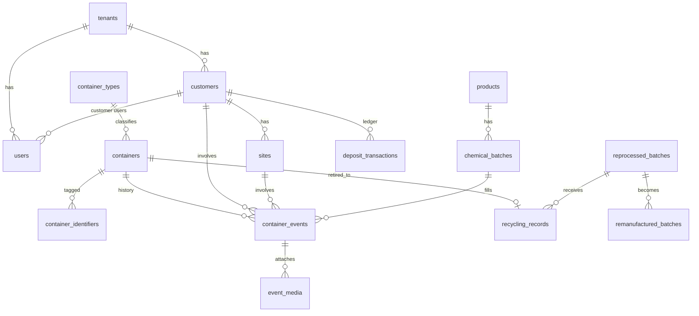
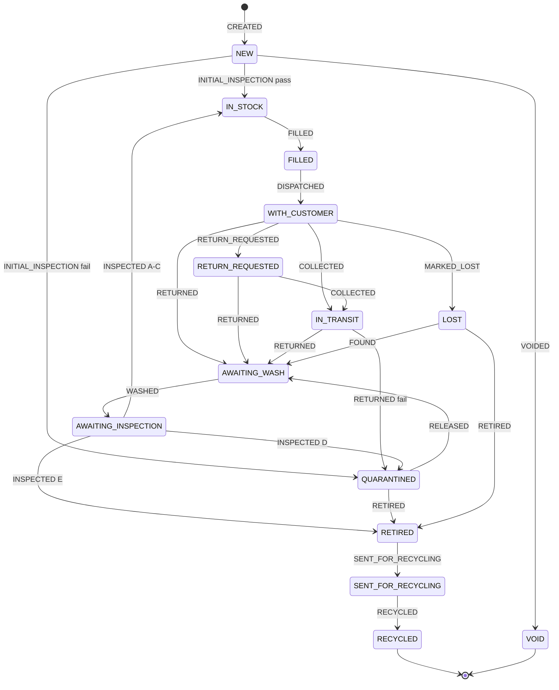

# Clariq Circular Container Platform - Architecture

**Version:** 0.2 (approved for build); build notes through 12 September 2026 (app v0.7.36) in the decision log and sections 20 to 24
**Date:** 24 August 2026
**Status:** Approved - Stage 0 may begin
**Owner:** Clariq

**Changes in 0.2:** ISO 59000 series alignment (new section 10.6, dashboard restructure in section 13, report methodology rules, schema additions in 8.1 and 8.5, value-retention mapping in 9.2); logo received; decision log and open items updated.

**Changes 9 and 10 September 2026:** production database purged of seeded demo data (migrations 0022 and 0023); demo rebuilt as a second Supabase project plus a second Netlify site, both from the one repository (new section 20); Netlify sites named `clariq-hub` (production, permanent, printed on labels) and `clariq-demo`; Supabase Free-plan pause recorded as a go-live blocker; auth email moved to custom SMTP (Gmail interim, Resend target).

This document is the single source of truth for how the platform is built. It is updated at the end of every build session. Anything not in here does not exist.

---

## 1. Purpose and principles

Every physical container has one permanent digital identity, and every significant event in its life is recorded against that identity.

The platform is a mobile-first Progressive Web App (PWA) backed by Supabase. There is no spreadsheet phase. The original brief's Google Sheets V1 and Phase 2 migration are superseded; the "Phase 2" architecture is built first, with V1 scope discipline.

Design principles, in priority order:

1. **Data discipline over features.** Append-only history, controlled vocabularies, no free text where a list will do.
2. **Scan → choose action → minimum fields → submit.** A container action takes under 30 seconds on a phone in a shed.
3. **Stunning and intuitive.** Any screen a customer or non-technical owner sees must be understandable without instruction.
4. **Owned and transferable.** Every account, key and domain belongs to Clariq. A new owner picks it up from `Handover.md`.
5. **Grows without rebuild.** Tenancy, roles, identifiers and integrations are structurally present from day one even where unused.

---

## 2. Stack and hosting

| Layer | Choice | Reason |
|---|---|---|
| Database, auth, storage, edge functions | Supabase (Postgres) | Row-level security, built-in auth (magic link, passkey), object storage for media, SQL export. Clariq-owned project. |
| Front end | React + TypeScript + Vite, PWA (installable, offline shell) | Static build, no server rendering needed. |
| Styling | Tailwind CSS with a Clariq design-token layer | Tokens (colour, type, spacing) live in one file for rebranding. |
| Hosting / CDN | Netlify (Pro), two projects from one repo: `clariq-hub` and `clariq-demo` (section 20) | Static PWA; Netlify and Vercel are equivalent for this build. Known over unknown. |
| Domain | `clariq-hub.netlify.app` (production, permanent) and `clariq-demo.netlify.app` | Custom domains `app.clariq.nz` and `demo.clariq.nz` are optional later additions; Netlify serves both addresses side by side, so labels printed with the netlify.app address never break. Marketing site untouched. |
| Email | Custom SMTP on Supabase Auth: Gmail (`clariqnz@gmail.com`, sender name Clariq) as interim; Resend with `clariq.nz` once DNS access exists | Built-in Supabase mailer is rate-capped and unbranded; never used for customers. |
| QR generation | Client-side (`qrcode` library) + PDF label sheet | No external service dependency. |
| QR scanning | Native phone camera (URL) and in-app scanner (`BarcodeDetector` with library fallback) | No app store, no hardware. |

**Why not Vercel:** for a static PWA with no server-side rendering, the two are functionally identical. Netlify is chosen because the owner already operates it. Nothing in the build is Netlify-specific; the `dist` folder deploys anywhere.

**Accounts to be created under Clariq before build starts:** Supabase organisation and project (Sydney region), Netlify team, Resend account, GitHub organisation and repository. Greg is a collaborator on each, not the owner.

---

## 3. Tenancy

The platform is single-tenant at launch (Clariq) but every business table carries `tenant_id`. One row exists in `tenants`. Row-level security policies filter on `tenant_id` from day one, so enabling a second tenant later is a data change, not a code change.

Hierarchy:

```
Platform Owner (Clariq)
└── Tenant: Clariq Operations
    ├── Staff users (roles below)
    ├── Customers (e.g. ABC Ltd)
    │   ├── Sites
    │   └── Customer users (read-only, own data)
    ├── Containers, Products, Batches, Deposits, Recycling records
    └── Settings (overdue thresholds, methodology factors, label text)
```

---

## 4. Roles and permissions

Roles are a lookup table. Permissions are boolean flags on the role, plus per-user overrides. Launch uses two roles; the others are defined and dormant.

| Permission | Admin | Warehouse Operator | Inspector | Driver | Sales / Account | Customer |
|---|---|---|---|---|---|---|
| View all containers | ✔ | ✔ | ✔ | ✔ | ✔ | own only |
| Create containers / print labels | ✔ | ✔ | | | | |
| Fill, dispatch | ✔ | ✔ | | | | |
| Record collected / delivered | ✔ | ✔ | | ✔ | | |
| Record returned + quick visual | ✔ | ✔ | ✔ | ✔ | | |
| Wash | ✔ | ✔ | | | | |
| Full inspection | ✔ | ✔ | ✔ | | | |
| Release from quarantine / retire (`can_authorise`) | ✔ | flag | flag | | | |
| Admin override (adjustment event) | ✔ | | | | | |
| Manage customers, sites, products, batches | ✔ | | | | ✔ | |
| Deposits ledger | ✔ | | | | ✔ | |
| Recycling records | ✔ | ✔ | | | | |
| Reports and dashboard | ✔ | ✔ | ✔ | ✔ | ✔ | own only |
| Settings, users, roles | ✔ | | | | | |
| Export data | ✔ | | | | ✔ | own only |

`can_authorise` is a per-user flag. Admin always has it. Any other role may be granted it individually.

---

## 5. Authentication

| Who | Method | Session |
|---|---|---|
| Platform Admin | Passkey (WebAuthn). Fallback email + TOTP if passkey support is not production-ready in Supabase at build time - confirmed before first login. | 12 hours, re-auth for settings and user management. |
| Staff | Magic link by email. | 30 days on the device. Devices are personal, not shared. |
| Customer | Magic link by email. | 30 days. |
| Public (unauthenticated scan) | None. | Sees the public container page only (section 7). |

Every action is attributed to `auth.uid()`. There is no "who are you" step because devices are singular. If shared devices are introduced later, a PIN-per-action layer can be added without schema change.

---

## 6. Identifiers

All IDs are generated by the database, never by the client.

| Entity | Format | Rule |
|---|---|---|
| Container | `CLQ-000127` | Ascending from a Postgres sequence. Never reused. Gaps are possible: a create that fails mid-transaction burns its number, because sequences do not roll back. |
| Voided container | same ID, status `VOID` | Reason mandatory. Sequence is not rewound. Voided IDs appear in audit and export. |
| Customer | `CUS-0001` | Sequential. |
| Site | `SITE-0001` | Sequential, global (not per customer). |
| Container type | `TYPE-5L-HDPE-01` | Human-assigned, validated unique. |
| Product | `PRD-0001` | Sequential. |
| Chemical batch | `EXT-260824-A` | Supplied by Clariq at batch receipt; format validated but not generated. Format to be confirmed. |
| Event | `EVT-00000001` | Sequential. |
| Deposit transaction | `DEP-00000001` | Sequential. |
| Recycling record | `REC-2026-004` | Year + sequence. |
| Reprocessed batch | `PCR-2026-007` | Year + sequence. |
| Remanufactured product batch | `RMP-2026-001` | Year + sequence. |

**Secondary identifiers.** `container_identifiers` holds any number of tags per container: `QR`, `RFID`, `NFC`, `BARCODE`. The QR is inserted at creation as `QR-CLQ-000127`. Adding RFID later is an insert, not a schema change.

---

## 7. QR and redirect layer

The label encodes `https://app.clariq.nz/c/CLQ-000127`. Nothing else.

The `/c/:id` route is handled by the app:

| Visitor | Sees |
|---|---|
| Not logged in | Container ID, "Property of Clariq - please return", return instructions, "Staff login" link. No product, batch or customer. |
| Customer user, container is theirs | ID, product name, SDS link, cycles completed, request collection button (Phase 2). |
| Customer user, container is not theirs | Same as not logged in. |
| Staff | Full container card and the action list for its current status. |

A `redirects` table (`path`, `destination`, `active`) sits in front of this so a future owner can point labels elsewhere without reprinting. Default: no redirect, app handles it.

---

## 8. Data model

Every business table has: `id`, `tenant_id`, `created_at`, `created_by`, `updated_at`, `updated_by`. Soft-delete via `archived_at` where deletion is ever appropriate; never on events.

### 8.1 Master data

- **tenants** - `name`, `settings` (JSON: overdue thresholds, methodology factors, label text)
- **users** - mirrors `auth.users`; `role_id`, `can_authorise`, `customer_id` (null for staff), `display_name`, `active`
- **roles** - `code`, `name`, permission flags
- **container_types** - `code`, `capacity_litres`, `material`, `empty_weight_g`, `recycled_content_pct`, `renewable_content_pct`, `replacement_cost`, `manufacturer`, `model`, `closure_type`, `design_life_cycles`, `compatible_product_groups[]`, `active`. The two content percentages are supplied by the container manufacturer and feed the ISO 59020 resource-inflow indicators (section 10.6); null until known, never guessed.
- **customers** - `code`, `legal_name`, `trading_name`, `primary_contact`, `email`, `phone`, `billing_details` (JSON), `account_status`, `return_arrangement`, `deposit_arrangement` (`PER_CONTAINER` \| `ACCOUNT` \| `NONE`), `xero_contact_ref`, `notes`
- **sites** - `code`, `customer_id`, `name`, `address` (structured), `region`, `contact`, `phone`, `delivery_instructions`, `collection_instructions`, `active`
- **products** - `code`, `name`, `product_group`, `manufacturer`, `concentration`, `sds_url`, `tech_info_url`, `compatibility_notes`, `active`
- **chemical_batches** - `code`, `product_id`, `supplier`, `supplier_lot`, `production_date`, `received_date`, `opened_date`, `quantity_received`, `quantity_remaining`, `expiry_date`, `notes`
- **reference_lists** - `list` (`RETIREMENT_REASON`, `QUARANTINE_REASON`, `WASH_METHOD`, `CONDITION_GRADE`, `RECYCLER`, `REMANUFACTURED_PRODUCT`…), `code`, `label`, `sort`, `active`. All dropdowns read from here; Admin edits them.

### 8.2 Containers (current state)

**containers** - `code`, `container_type_id`, `supplier`, `supplier_ref`, `purchase_date`, `purchase_cost` (defaults from type, editable), `commissioning_date`, `status`, `location` (`WAREHOUSE` \| `CUSTOMER_SITE` \| `IN_TRANSIT` \| `RECYCLER` \| `UNKNOWN`), `current_customer_id`, `current_site_id`, `current_product_id`, `current_batch_id`, `current_order_ref`, `fill_count`, `return_count`, `completed_cycle_count`, `last_fill_at`, `last_dispatch_at`, `expected_return_at`, `last_return_at`, `last_inspection_at`, `last_wash_at`, `condition_grade`, `deposit_value`, `deposit_status`, `retirement_date`, `retirement_reason`, `recycling_record_id`, `void_reason`, `notes`

**This table is never written by the application directly.** Every column other than the purchase/commissioning fields is maintained by a trigger on `container_events`. This guarantees the current state always agrees with history.

**container_identifiers** - `container_id`, `kind`, `value`, `attached_at`, `detached_at`

### 8.3 Events (the permanent record)

**container_events** - `code`, `container_id`, `event_type`, `occurred_at`, `recorded_at`, `actor_id`, `from_status`, `to_status`, `from_location`, `to_location`, `customer_id`, `site_id`, `product_id`, `batch_id`, `order_ref`, `quantity`, `payload` (JSON, event-specific fields - inspection grades, wash method, quick-visual answers, reasons), `notes`, `adjusts_event_id` (for adjustments), `override_reason`

Rules enforced in Postgres:
- `INSERT` only. `UPDATE` and `DELETE` are revoked from every application role including Admin.
- A trigger validates `from_status → to_status` against the transition table (section 9). Invalid transitions are rejected unless `event_type = ADJUSTMENT` and the actor has the admin-override permission and `override_reason` is present.
- A trigger updates `containers` after insert.

**event_media** - `event_id`, `kind` (`PHOTO` \| `VIDEO`), `storage_path`, `size_bytes`, `duration_s`, `caption`. Media is linked to the event, never to the container alone.

### 8.4 Deposits

**deposit_transactions** - `code`, `customer_id`, `container_id` (null for account-level), `kind` (`CHARGED` \| `REFUNDED` \| `FORFEITED` \| `ADJUSTMENT`), `amount`, `occurred_at`, `reason`, `xero_invoice_ref`, `event_id` (the dispatch or return that triggered it), `notes`

Balance is a view, not a stored column. Reconciliation to Xero is a report keyed on `xero_invoice_ref`.

### 8.5 Recycling and remanufacturing

- **recycling_records** - `code`, `container_id`, `material`, `weight_g`, `retired_at`, `retirement_reason`, `sent_at`, `recycler`, `recycler_ref`, `recycler_declaration_ref` (certification or declaration reference held from the recycler), `chain_of_custody_note`, `recycling_batch_ref`, `weight_recovered_g`, `processing_method`, `reprocessed_batch_id`, `notes`. The declaration and chain-of-custody fields support secondary-materials traceability in the sense of ISO 59014.
- **reprocessed_batches** - `code`, `material`, `total_input_weight_g`, `total_output_weight_g`, `processor`, `processed_at`
- **remanufactured_batches** - `code`, `reprocessed_batch_id`, `product_name` (from reference list), `quantity`, `destination`, `manufactured_at`

This gives the chain: container → recycling record → reprocessed batch → remanufactured batch, each a foreign key.

### 8.6 Audit log (master data)

**audit_log** - `table_name`, `row_id`, `action`, `actor_id`, `at`, `old_row` (JSON), `new_row` (JSON)

Populated by a generic trigger on every master-data table. Combined with `container_events`, every change in the system has an actor, a time, a before and an after.

### 8.7 Entity diagram



---

## 9. Container state machine

### 9.1 Reconciled statuses

The brief listed 22 statuses and 21 event types with overlaps. They reconcile to 14 statuses. Original names are mapped so nothing from the brief is lost.

| Status | Meaning | Brief statuses absorbed | Colour group |
|---|---|---|---|
| `NEW` | Created, label printed, not yet inspected | New, Awaiting Initial Inspection | Neutral |
| `IN_STOCK` | Empty, clean, inspected, ready to fill | Approved for Use, In Stock, Washed, Approved for Refill | Ready |
| `FILLED` | Product and batch inside, awaiting dispatch | Filled, Ready for Dispatch | Ready |
| `WITH_CUSTOMER` | Dispatched to a customer site | With Customer | Out |
| `RETURN_REQUESTED` | Customer or staff has requested collection | Return Requested, Return Scheduled | Out |
| `IN_TRANSIT` | Collected, not yet at warehouse | (implied by Collected event) | Out |
| `AWAITING_WASH` | Returned, quick visual passed | Returned, Awaiting Wash | Processing |
| `AWAITING_INSPECTION` | Washed, awaiting full inspection | Awaiting Inspection | Processing |
| `QUARANTINED` | Held pending authorised decision | Quarantined, Damaged | Problem |
| `LOST` | Not returned, written off | Lost | Problem |
| `RETIRED` | Withdrawn from service, awaiting recycling | Retired, Awaiting Recycling | End of life |
| `SENT_FOR_RECYCLING` | Physically with recycler | Sent for Recycling | End of life |
| `RECYCLED` | Material recovered; reprocessing recorded on the recycling record | Recycled, Reprocessed | End of life |
| `VOID` | ID cancelled before use | (new) | End of life |

"Overdue" is not a status. It is a calculated flag on `WITH_CUSTOMER` and `RETURN_REQUESTED` (section 10.2).

### 9.2 Event types and allowed transitions

| Event | From | To | Required fields | Counters |
|---|---|---|---|---|
| `CREATED` | - | `NEW` | type, supplier, purchase date, cost | |
| `VOIDED` | `NEW` | `VOID` | reason | |
| `INITIAL_INSPECTION` | `NEW` | `IN_STOCK` or `QUARANTINED` | grade, pass/fail | |
| `FILLED` | `IN_STOCK` | `FILLED` | product, batch, quantity | fill_count +1 |
| `DISPATCHED` | `FILLED` | `WITH_CUSTOMER` | customer, site, expected return, order ref | |
| `DELIVERED` | `WITH_CUSTOMER` | `WITH_CUSTOMER` | - (driver confirmation, Phase 2) | |
| `RETURN_REQUESTED` | `WITH_CUSTOMER` | `RETURN_REQUESTED` | requested by, preferred date | |
| `COLLECTED` | `WITH_CUSTOMER`, `RETURN_REQUESTED` | `IN_TRANSIT` | site | |
| `RETURNED` | `WITH_CUSTOMER`, `RETURN_REQUESTED`, `IN_TRANSIT` | `AWAITING_WASH` or `QUARANTINED` | quick visual: cap present, residue, contamination, visible damage | return_count +1; completed_cycle +1 if a `DISPATCHED` follows the last `FILLED` |
| `WASHED` | `AWAITING_WASH` | `AWAITING_INSPECTION` | method, operator, outcome | |
| `INSPECTED` | `AWAITING_INSPECTION` | `IN_STOCK` (A–C), `QUARANTINED` (D), `RETIRED` (E) | grade, sub-conditions, QR readable, reason if D/E | |
| `QUARANTINED` | any active status | `QUARANTINED` | reason | |
| `RELEASED` | `QUARANTINED` | `AWAITING_WASH` or `AWAITING_INSPECTION` | `can_authorise`, decision note | |
| `MARKED_LOST` | `WITH_CUSTOMER`, `RETURN_REQUESTED`, `IN_TRANSIT` | `LOST` | reason | |
| `FOUND` | `LOST` | `AWAITING_WASH` | where found | |
| `RETIRED` | `QUARANTINED`, `AWAITING_INSPECTION`, `IN_STOCK`, `LOST` | `RETIRED` | `can_authorise`, reason, est. weight, intended destination | |
| `SENT_FOR_RECYCLING` | `RETIRED` | `SENT_FOR_RECYCLING` | recycler, batch ref, date, weight | |
| `RECYCLED` | `SENT_FOR_RECYCLING` | `RECYCLED` | weight recovered, method, reprocessed batch | |
| `ADJUSTMENT` | any | any | Admin only, override reason, `adjusts_event_id` optional | as specified |
| `NOTE` | any | same | free text, media | |

Everything not in this table is rejected by the database. The mobile action list for a container is generated from this table, so staff only ever see valid actions.

Each event type additionally carries a `value_retention_process` in reference data, mapping operational language to ISO 59004 terms: `WASHED`, `INSPECTED`, `FILLED`, `DISPATCHED`, `RETURNED` → *reuse*; `SENT_FOR_RECYCLING`, `RECYCLED` → *recycling*; remanufactured-batch creation → *remanufacture*. Staff screens keep the operational words; reports and customer-facing screens use the ISO vocabulary.

### 9.3 Diagram



### 9.4 Inspection grades

| Grade | Label | Outcome |
|---|---|---|
| A | Excellent | `IN_STOCK` |
| B | Good | `IN_STOCK` |
| C | Serviceable | `IN_STOCK`, flagged for watch |
| D | Quarantine | `QUARANTINED`, reason mandatory |
| E | Retire | `RETIRED`, reason and estimated weight mandatory, requires `can_authorise` (otherwise lands in `QUARANTINED` pending authorisation) |

---

## 10. Calculations

All calculations are SQL views or generated columns, never client-side, so exports, dashboards and reports agree.

### 10.1 Cycles

- **Fill count** - number of `FILLED` events.
- **Return count** - number of `RETURNED` events.
- **Completed cycle** - a `RETURNED` event preceded (since the last `RETURNED` or creation) by `FILLED` then `DISPATCHED`. A container returned without being filled and dispatched does not count.
- **Days with customer** - `RETURNED.occurred_at − DISPATCHED.occurred_at` per cycle.
- **Average cycle time** - mean of the above, per container, per customer and fleet-wide.

### 10.2 Overdue

Thresholds live in tenant settings; defaults below.

| Flag | Rule | Default |
|---|---|---|
| Not due | today < expected − due_soon_days | |
| Due soon | within `due_soon_days` of expected | 7 days |
| Overdue | past expected by up to `overdue_days` | 14 days |
| Significantly overdue | past expected by more than `overdue_days` | > 14 days |

Days outstanding = today − dispatch date, shown on every out-with-customer container.

### 10.3 Economics

- Capital cost per use = `purchase_cost ÷ completed_cycle_count` (null until first cycle).
- Fleet replacement value = Σ `container_types.replacement_cost` over active containers.
- Lost container value = Σ replacement cost over `LOST`.
- Lifecycle cost per fill (Phase 2) - schema includes a `container_costs` table (`container_id`, `cost_type`, `amount`, `event_id`) so wash, collection, repair and cap costs can be attributed per event later.

### 10.4 Material avoidance (estimated)

Methodology factors in tenant settings, editable by Admin:

- `single_use_equivalent_rule` - default `completed_cycles − 1`
- `single_use_weight_g` - default: container type's `empty_weight_g`
- `emissions_factor_kg_co2e_per_kg` - default null (not shown until set)

Packaging avoided (g) = Σ over containers of `(completed_cycles − 1) × empty_weight_g`, floored at zero.

### 10.5 Measured vs estimated

Every metric carries a `basis` of `MEASURED` or `ESTIMATED`. Estimated metrics render with an "Estimated" badge and a link to the methodology text (Admin-editable). Admin may replace an estimate with a measured value via a `metric_overrides` record; the estimate is retained beside the override with actor and reason, so the substitution is auditable.

### 10.6 ISO 59000 series alignment

The platform aligns its language and measurement structure with the ISO 59000 circular economy family: ISO 59004:2024 (vocabulary and principles), ISO 59020:2024 (measuring and assessing circularity performance), ISO 59014:2024 (traceability of secondary materials recovery) and ISO 59040:2025 (Product Circularity Data Sheet).

**Measurement frame (ISO 59020).** The "system in focus" is the Clariq container fleet, measured over a selectable period. Circularity metrics are grouped as:

| Group | Metrics | Source |
|---|---|---|
| Resource inflows | New containers commissioned in period; recycled content %; renewable content % | `container_types` content fields × commissioned containers |
| Value retention | Fills, completed cycles, return rate, average rotations, average cycle time | Event history (section 10.1) |
| Resource outflows | Mass retired; mass sent to recycler; mass recovered; **recovery rate** = recovered ÷ retired | `recycling_records` weights |
| Losses | Lost containers, count and mass | `LOST` status × type empty weight |

All figures are recomputable for any period from the append-only event history, which is what makes them reproducible and verifiable in the sense the standard requires.

**Claim wording rule (binding).** Reports and marketing copy generated by the platform may state that figures are *"prepared with reference to the measurement framework of ISO 59020:2024"*. The platform must never generate the words "compliant with", "certified to" or "conforms to" any ISO 59000 standard. Conformity is a formal assessment Clariq has not undertaken; a false claim is the greenwashing exposure the series exists to prevent. This rule is enforced in report templates, not left to memory.

**Traceability (ISO 59014).** The container → recycling record → reprocessed batch → remanufactured batch chain, with weights at each step and the recycler declaration reference, provides mass-balance traceability for secondary-material claims.

**Material passport (ISO 59040, Phase 3).** The future passport is structured as PCDS-style True/False circularity statements per container type, backed by the container's event history. A PCDS is not an EU digital product passport; the PCDS data is input to one, no more.

**Glossary.** The app includes a short glossary page mapping Clariq operational terms to ISO 59004 vocabulary, visible to staff and customers.

**Clariq action (outside the build).** Clariq should purchase ISO 59004 and ISO 59020 (via Standards New Zealand) before making public marketing claims referencing them; ISO 59014 and 59040 when Phase 3 approaches.

---

## 11. Media

| | Photo | Video |
|---|---|---|
| Where | Inspection, quarantine, return quick-visual, recycling, any `NOTE` | Same |
| Client processing | Resized to max 1600 px longest edge, JPEG ~80%, target ≤ 500 KB | Capped at 30 seconds, re-encoded on device where the browser supports it |
| Hard limit | 5 MB | 60 MB |
| Storage | Supabase Storage bucket `event-media`, path `tenant/container/event/file` | Same |
| Access | Signed URLs, staff and Admin only. Customers see none in V1. | Same |

Retention: indefinite. Storage cost at expected volumes is negligible; revisit if it is not.

---

## 12. Notifications

V1: one daily email digest to Admin (07:00 NZ time) listing overdue and significantly overdue containers grouped by customer, with counts, longest outstanding and replacement value at risk. Sent by a Supabase scheduled edge function via Resend.

The `notification_rules` table (`trigger`, `channel`, `recipient_role`, `active`) exists from day one with only this rule active, so the triggers in brief section 29 are additions, not a new subsystem.

---

## 13. Dashboard and reports

**Screen 1 - Today.** Overdue view (section 10.2) and fleet counts by status, each status a tappable tile. This is the landing screen for staff.

**Screen 2 - Circularity.** Structured on the ISO 59020 groups in section 10.6, with a period selector (month, quarter, year, all time): resource inflows, value retention, resource outflows, losses, plus packaging avoided (estimated badge). Every figure recalculates for the selected period.

**Screen 3 - Financial.** Fleet cost, replacement value, lost value, deposit balances, cost per use.

**Demo (lockstep).** From 10 September 2026 the demo is the real app running against its own Supabase project (`clariq-demo`) and published at `clariq-demo.netlify.app` from the same repository (section 20). The in-memory demo gateway (`?demo=1`, or no Supabase variables present) remains for local development only; it is not the sales demo, because a third of the app (audit walk, master data, chemicals on site, Ask Clariq, photos) reads Supabase directly and has no in-memory twin. Lockstep is structural: one codebase, both sites rebuild on every commit, and every migration is applied to both projects.

**Customer report.** Per customer, date range (month, quarter, year, custom). On-screen and Clariq-branded PDF. Fields as brief section 21, grouped using the ISO vocabulary. Ends with a methodology block: which figures are measured vs estimated, the methodology text, and the fixed sentence *"Prepared with reference to the measurement framework of ISO 59020:2024."* The claim wording rule in section 10.6 applies. Available to the customer's own users.

---

## 14. Design

- **Mobile first.** Every screen designed at 390 px width first, then widened. Staff screens are thumb-reachable; primary action at the bottom.
- **Light and dark**, following device preference, with manual toggle. Light mode tuned for outdoor contrast.
- **Colour-blind safe.** The Admin is colour-blind. Status colours use the Okabe–Ito palette and are never the only signal: every status has an icon and a text label.

| Group | Statuses | Colour | Icon |
|---|---|---|---|
| Ready | `IN_STOCK`, `FILLED` | Bluish green `#009E73` | check-circle |
| Out | `WITH_CUSTOMER`, `RETURN_REQUESTED`, `IN_TRANSIT` | Blue `#0072B2` | truck |
| Processing | `AWAITING_WASH`, `AWAITING_INSPECTION` | Orange `#E69F00` | refresh |
| Overdue (flag) | - | Vermillion `#D55E00` | alert-triangle |
| Problem | `QUARANTINED`, `LOST` | Reddish purple `#CC79A7` | shield-alert |
| End of life | `RETIRED`, `SENT_FOR_RECYCLING`, `RECYCLED`, `VOID` | Grey `#7A7A7A` | archive |
| Neutral | `NEW` | Sky blue `#56B4E9` | plus-circle |

These are functional colours. Brand colours (backgrounds, type, accents) come from the Clariq palette and logo, to be supplied before UI build. Functional colours are checked against the brand for contrast at that point.

- **Typography.** Minimum 16 px body, 18 px on forms. Large tap targets (≥ 48 px).
- **Tone.** Calm, spacious, no clutter. A scan result shows one card and one list of actions.

---

## 15. Export, backup, ownership

- **Export.** Admin: any table to CSV or XLSX from the app. Customer: their own containers and report. Event history export always includes the full payload.
- **Backup.** Supabase daily automated backups (Pro plan, 7-day retention) plus a weekly scheduled edge function writing a full CSV bundle to a Clariq-owned storage bucket. Media bucket included.
- **Recovery.** Documented in `Handover.md` with a tested restore procedure before go-live.
- **Ownership.** All accounts under Clariq. No credentials are ever stored in the repository; they live in Netlify and Supabase environment settings.
- **API.** Supabase exposes a REST and realtime API over the same RLS policies. Future integrations (Xero, Shopify, CRM) use this; no separate API layer is needed.

---

## 16. Build stages

| Stage | Scope | Definition of done |
|---|---|---|
| 0 | Accounts, repo, domain, this document approved | Greg can log in as Admin with a passkey on `app.clariq.nz` |
| 1 | Schema, RLS, state-machine triggers, audit triggers, seed data | Every transition in 9.2 has a passing database test; invalid ones fail |
| 2 | Container creation, label PDF, public scan page | A printed label scans to the public page on a phone |
| 3 | Staff actions: fill, dispatch, return, wash, inspect, quarantine, release, retire | A container completes a full cycle from a phone with no keyboard entry beyond notes |
| 4 | Customers, sites, products, batches, reference lists | Admin manages all master data in-app |
| 5 | Dashboard screens 1–3, overdue digest | Digest received; overdue tiles correct against test data |
| 6 | Customer login, customer report, PDF | ABC Ltd test user sees only its own data |
| 7 | Deposits ledger, recycling records | Chain container → reprocessed → remanufactured recorded end to end |
| 8 | Media, dark mode polish, export, backup job, `Handover.md` | Restore test passes; handover walkthrough done with Clariq |

Each stage ends with an update to this document.

---

## 17. Risks and limitations

| Risk | Mitigation |
|---|---|
| Supabase passkey support not production-ready at build time | Email + TOTP fallback; passkey enabled when available with no schema change |
| Offline use in a warehouse with poor signal | PWA caches the shell. The local action queue described in the brief is NOT built (confirmed 10 Sep 2026): an action without signal shows "Can't reach Clariq" and must be retried. Open item 15 |
| Video re-encoding varies by phone browser | Hard size limit enforced server-side; oversized uploads rejected with a clear message |
| Batch ID format not yet confirmed | Stored as validated string; validation rule adjustable in settings |
| Colour palette clash between functional and brand colours | Resolved at UI stage with contrast checks; functional colours can shift within the Okabe–Ito set |
| Single Admin is a single point of access | Second Admin recommended before go-live; documented in `Handover.md` |
| Supabase Free plan pauses a project after seven days without traffic; first visitor after that sees errors until an owner restores it (happened to production 9 Sep 2026) | Production: move to Pro before the first live customer (never pauses, daily backups, section 15). Demo: scheduled keep-awake ping (open item 11) |
| Netlify site name is baked into every printed label | `clariq-hub` is permanent: never renamed, never deleted and recreated. Adding `app.clariq.nz` later does not retire the netlify.app address |

---

## 18. Open items

1. Chemical batch ID format and whether Clariq or supplier assigns it.
2. Clariq colour palette - logo received 24 Aug 2026 (dark charcoal geometric mark on off-white); palette still required before Stage 2 UI.
3. Return instructions text for the public scan page.
4. Label wording confirmation: "CLARIQ / RETURN • REUSE • RECOVER / Container ID / QR / Property of Clariq - please return".
5. Who at Clariq will be the second Admin.
6. Clariq to purchase ISO 59004 and ISO 59020 before public marketing claims reference them (section 10.6).
7. Recycled/renewable content percentages to be requested from the container manufacturer.
8. Production Supabase project to move from Free to Pro before the first live customer (section 17).
9. Drop the `demo_snapshot` schema on production; the demo seed has been reconciled against it (section 20.4).
10. Custom domains `app.clariq.nz` and `demo.clariq.nz`: optional, when DNS access exists.
11. Keep-awake ping: built, `netlify/functions/keepalive.mts`; confirm it appears under Functions in both Netlify projects after the next deploy.
12. Resend SMTP on both projects once `clariq.nz` DNS records can be added; Gmail SMTP is the interim (section 20.6).
13. Demo banner: built (section 20.2, rule 8).
14. Branded magic link template on both projects.
15. Offline action queue (section 17): not built. Decide whether it is needed before the first warehouse goes live.
16. Migrations 0027 and 0028 to be applied to production once the project is responsive; both are on demo.
17. Production to Pro plan: promoted from "before first customer" to "before further maintenance work" after the 10 Sep Disk IO exhaustion made the project unresponsive for the day.

---

## 19. Decision log

| Date | Decision | Rationale |
|---|---|---|
| 2026-08-24 | No Google Sheets phase; Supabase from day one | Avoids a throwaway system and a migration |
| 2026-08-24 | `tenant_id` on every table, single tenant at launch | Licensing possible later without rebuild |
| 2026-08-24 | Netlify + Supabase | Equivalent to alternatives for a static PWA; known to owner |
| 2026-08-24 | Passkey for Admin, magic link for staff and customers | Simplicity for users, strong protection on the account that sees everything |
| 2026-08-24 | State machine enforced in the database, Admin override via adjustment event | Illogical transitions impossible; exceptions remain auditable |
| 2026-08-24 | Process order: Return → quick visual → Wash → full inspection → In Stock | Matches Clariq's actual handling |
| 2026-08-24 | Inspection grade is the outcome (D quarantines, E retires) | Removes a second decision step on the form |
| 2026-08-24 | Container IDs strictly sequential, voidable, never reused | Brief requirement, with a clean path for spoiled labels |
| 2026-08-24 | Purchase cost per container defaulting from type; weights and replacement cost on type | Accurate economics without repetitive entry |
| 2026-08-24 | Estimated data always badged; Admin override retains the estimate | Brief section 20; auditable substitution |
| 2026-08-24 | Photos and 30-second video on events from V1 | Cheap to include, high operational value |
| 2026-08-24 | Public scan page shows identity and return instructions only | Containers on customer sites are scannable by anyone |
| 2026-08-24 | Okabe–Ito functional palette, icon on every status | Admin is colour-blind |
| 2026-08-24 | Align vocabulary and metrics with ISO 59000 series; dashboard structured on ISO 59020 inflow/retention/outflow/loss groups | Differentiated, verifiable circularity claims; language of the standard without conformity claims |
| 2026-08-24 | Binding wording rule: "prepared with reference to", never "compliant/certified/conforms" | Greenwashing exposure; conformity requires formal assessment |
| 2026-08-24 | Recycled and renewable content % captured on container types | ISO 59020 core inflow indicator; unobtainable retroactively if not asked of the manufacturer now |
| 2026-08-24 | Phase 3 material passport structured as ISO 59040 PCDS statements | Avoids reinventing the passport schema later |
| 2026-08-24 | Built-in demo mode behind the same gateway interface | Lockstep demo by construction; sales and training tool at zero marginal cost |
| 2026-08-24 | Label geometry externalised to `labels/label-spec.json` | Stock size/waterproof/adhesive unconfirmed; production print blocked until domain is live |
| 2026-08-24 | Marketing one-pager wording follows the section 10.6 claim rule | "Prepared with reference to"; explicit no-certification line in the footer |
| 2026-08-24 | Domain corrected: clariq.nz (app.clariq.nz), not clariq.co.nz | Owner correction; QR base URL, email domain and all documents updated |
| 2026-08-30 | Product per use is history: the container card shows a fill history (one row per `FILLED` event, closed by the dispatch and return that followed) and the current product beside the container number on the card and in every list | Same container carries different products over its life (bleach, then BAC); the FILLED events already held it, the screens did not show it |
| 2026-08-30 | `current_product_id` and `current_batch_id` clear at `WASHED` (and at `INSPECTED`), not at `RETURNED` | Residue is still relevant to the quick visual at return; the container is only empty once washed. Migration 0019 |
| 2026-08-30 | Product-group change on a fill raises a warning, never a block; container-type `compatible_product_groups` is checked the same way | The state machine already forces wash and inspect between fills; the warning is the operator's cue, the database is not the judge of chemistry |
| 2026-08-30 | Customer users sign in to Today, status lists, Overdue, Circularity and their own report; lens locked to their `customer_id`, no picker | Previously a customer sign-in bounced to a route that did not exist. `RequireAccount` gate; migration 0020 lets customers read their own events and tenant master data names |
| 2026-08-30 | Customer-facing status labels: "With you", "Collection requested", "On its way back"; header shows customer name and locations | "With customer" is meaningless to the customer |
| 2026-08-30 | Scan screen diagnoses camera failure (no https, permission denied, no camera, camera busy) and offers retry | A generic "not available" hid the cause during testing; plain http on a LAN address is the usual one |
| 2026-08-30 | Every report: sections from one query result, exported as PDF and XLSX (sheet per section plus raw Events); by-location section when a customer has more than one site; customers can open their own Circularity figures | Customer request; XLSX and by-location land with the reporting batch |
| 2026-08-30 | Hazard classes at product level, seeded with GHS Rev 7 classes and categories; identifiers CAS, AACN (AU), HSNO approval or group standard (NZ), UN number and DG class, GTIN, supplier code; capture by barcode scan, then pick-list, then manual; OCR deferred | AU and NZ both use GHS Rev 7; AICIS is keyed on CAS; the customer is a workplace holder, not an AICIS introducer, and report wording says so |
| 2026-08-30 | Export bar on every report (Customer report, Circularity, Chemical inventory): Download PDF and Download XLSX, identical for staff and customer views; customer report period bounding applied (this month, quarter, year, last 12 months, all time) | Customer request; one query result feeds screen, PDF and XLSX so they cannot disagree |
| 2026-08-30 | Customer report always covers all locations; a by-location section appears when the customer has more than one site, with returns attributed to the site of the container's last dispatch | Multi-site organisations are the primary entry market |
| 2026-08-30 | App-wide date format dd-mm-yyyy (`lib/dates.ts`); XLSX dates are real date cells with that display format; file names use it too (folders sort by Date Created) | Owner request; one helper so no screen drifts |
| 2026-08-30 | Container card in customer view: "With you" chip, no staff actions, no Customer row; a customer opening a container that is not theirs lands on the public page | The card was still showing staff labels through the customer lens |
| 2026-08-30 | Ease-of-use pass (section 21): role-based home with one verb and three doors, plain-language labels, purpose line and help mark on every screen, done screen with next steps, teaching empty states, first-run cards, "how do I" in Ask Clariq, `ui_events` usage signals | Objective: usable by a first-time user without instruction |
| 2026-09-09 | Demo to be a second Netlify site from the same repository (NaloHub two-site model); the demo tenant idea is not pursued | Lockstep by construction; Clariq's tenancy stays reserved for real licensees |
| 2026-09-10 | Demo backend is a second Supabase project (`clariq-demo`), not the in-memory gateway | Code review showed audit walk, master data, inventory, Ask Clariq and photos bypass the gateway; an in-memory demo would need every feature built twice and would lag production. The real app on a second project can never lag |
| 2026-09-10 | Netlify projects named `clariq-hub` (production) and `clariq-demo`; `clariq-hub` treated as permanent from this date | Labels carry the full URL; the netlify.app address remains valid if a custom domain is added later |
| 2026-09-10 | Demo-only migrations live in `supabase/demo/`, never in `supabase/migrations/` | `supabase db push` and the connector workflow must never carry seed or reset functions to production |
| 2026-09-10 | Supabase Auth email via custom SMTP: Gmail interim, Resend target | Built-in mailer is capped at a few emails per hour and unbranded; DNS for `clariq.nz` not yet accessible |
| 2026-09-10 | Netlify team upgraded to Pro | Free credits exhausted; production deploys were paused |
| 2026-09-10 | Action list filtered by the signed-in role's permission flags, not only by `can_authorise` | End-to-end test showed a driver offered Fill; Architecture 9.2 promises staff only see valid actions |
| 2026-09-10 | `?demo=1` disabled on hosted builds; in-memory gateway is for local development only | The hosted demo is the real app; the in-memory world has different customers and would confuse a prospect |
| 2026-09-10 | Offline action queue recorded as not built | Section 17 claimed it; the code shows a retry message only. Decision on scope deferred (open item 15) |
| 2026-09-09 | Seeded demo and test data purged from production (migration 0023) after a full copy to schema `demo_snapshot` (migration 0022); all sequences restarted so the first real container is CLQ-000001 | Clean start for the first customer; the copy lets the demo seed be reconciled from real records rather than memory |
| 2026-09-09 | Migration 0023 is the single sanctioned exception to append-only: the two `reject_mutation` delete triggers were disabled for that migration only and re-enabled inside it | Pre-customer data with no operational value; the exception is named in the migration header and here so it can never be cited as precedent |
| 2026-09-09 | All five container types kept through the purge, including `TYPE-AUDIT-UNKNOWN` | Needed by the audit walk; manufacturer and model fields to be corrected in-app when real stock is confirmed |

---

## 20. Environments: production and demo (added 9 September 2026, revised 10 September)

One repository, two Supabase projects, two Netlify projects. Everything that is code is shared; everything that is data is separate.

### 20.1 The two environments

| | Production (the hub) | Demo |
|---|---|---|
| Address | `https://clariq-hub.netlify.app` (permanent, on labels) | `https://clariq-demo.netlify.app` |
| Netlify project | `clariq-hub`, team clariqnz (Pro) | `clariq-demo`, same team |
| Supabase project | `oksxzvomjjsjhjqifqhk`, "Circular Container Tracker", Sydney | `yuwpakqhcwjheibfaeof`, "clariq-demo", Sydney |
| Netlify env vars | `VITE_SUPABASE_URL`, `VITE_SUPABASE_ANON_KEY` for production | same two names, demo project's values |
| Data | real customers only; sequences start at 1 | deterministic seeded fleet (144 containers, 6 customers), reset on demand |
| Users | invited real staff and customers; Admins: Greg, Jay (`jnf1306@gmail.com` and `info@clariq.nz`), Clariq Admin | same Admins; plus `clariqnz+staff@gmail.com` (Warehouse) and `clariqnz+customer@gmail.com` (Customer, on CUS-0001) |
| Ask Clariq | own corpus and secrets | identical corpus copied from production; own secrets |
| Labels | printed here only | never printed |

Both projects run the same migrations, the same edge functions (`ask`, `embed_chunks`) and the same app build. The demo is the real product; nothing in it is simulated.

### 20.2 Rules

In step:
1. Every migration is applied to both projects, production first, one `apply_migration` call each, then committed to `supabase/migrations/`. A migration is not finished until it is on both.
2. Every edge function change is deployed to both.
3. Code needs nothing extra: one commit to `main` rebuilds both Netlify projects.
4. Nothing is created by hand on either project. Anything that was (the tenant row, `load_corpus_file`) has since been captured as a migration.

Apart:
5. Demo data never enters production. Migration 0023 purged what was there; the seed runs only on the demo project.
6. Production-only migrations (0022 snapshot, 0023 purge) are not applied to demo. Demo-only migrations (tenant row, `dblink`, `seed_demo`, `reset_demo`, invites) live in `supabase/demo/`, not in `supabase/migrations/`, so no tooling can carry them to production.
7. Real labels are printed from production only, carrying `https://clariq-hub.netlify.app/c/CLQ-000000`. The `clariq-hub` project name is never changed and never deleted.
8. The demo shows a persistent "Demo environment" banner (`components/DemoBanner.tsx`), driven by hostname (`lib/env.ts`) so it cannot ship to production. `?demo=1` is ignored on hosted builds; the in-memory gateway exists for local development only.

Both:
9. `container_events` and `audit_log` are append-only; `containers` is trigger-written only; the ISO wording rule; RLS on every table.

### 20.3 Why a second project rather than an in-memory demo

The gateway interface covers the core built on 24 August (container card, actions, dashboard, status lists, customer report, labels). Everything built since reads Supabase directly: audit walk (`lib/audit.ts`), master data (`AdminMasterData.tsx`), chemicals on site (`InventoryReportPage.tsx` on `v_site_inventory`), Ask Clariq, photo upload and `ui_events`. An in-memory demo would need every one of those rebuilt in TypeScript and kept in step with SQL views and RPCs indefinitely. A second project costs one extra `apply_migration` call per migration and nothing else.

### 20.4 The purge, the snapshot and the seed

Until 9 September the demo fleet plus later test records lived in production. Migration 0022 copied every affected table to schema `demo_snapshot` on production (no app access); migration 0023 deleted them from `public`, restarted every sequence and asserted the result. The seed function on the demo project (`supabase/demo/0024_demo_seed_and_reset.sql`) reproduces that fleet deterministically (`setseed(0.42)`) through `create_container()` and the event trigger, with the Clarq test customer, Meremere and the 24 NEW containers appended; it was verified against `demo_snapshot` (144 containers, 246 deposits, 18 recycling records). `demo_snapshot` can now be dropped (open item 9).

Migration 0023 is the single sanctioned exception to append-only, recorded in the decision log.

### 20.5 Reset and keep-awake

`reset_demo()` (owner-only, run through the connector or SQL editor) purges every business row, restarts the sequences, re-runs `seed_demo()` and reattaches customer-linked users to CUS-0001. Run it after any sales walk that changed data. A Netlify scheduled function (`netlify/functions/keepalive.mts`, daily) makes one REST request to the site's own Supabase project so the Free-plan demo never pauses; it runs on production too, harmlessly.

### 20.6 End-to-end verification (10 September 2026)

The demo project was driven as Admin, Warehouse, Inspector, Driver, Customer and anonymous through 47 checks covering the full lifecycle, every state-machine rejection, every permission gate, adjustments, quarantine and release, void and sequence behaviour, batch validation, deposits, the audit walk end to end, the site inventory basis before and after a sighting, overdue flags, customer isolation on every table, the public lookup and corpus access, inside one rolled-back transaction. Findings and remedies:

| Finding | Remedy |
|---|---|
| Warehouse operators had no `record_sighting` (0012 misspelled the role code) so could not audit walk | 0028 |
| Non-admin staff could not add a location during a walk (policy required `manage_master_data`) | 0027 |
| `load_corpus_file` and `accept_user_invite` executable by anon | 0027 |
| Action list not filtered by role; a driver was offered Fill and rejected on submit | `supabaseGateway.getActions` now filters on the role's flags (Architecture 9.2 restored) |
| `?demo=1` on a hosted build swapped in the in-memory world | ignored on hosted builds (`lib/env.ts`) |
| No offline queue despite section 17 | recorded as not built, open item 15 |
| Sequence gaps after failed creates | section 6 wording corrected |
| Production nano compute exhausted its Disk IO budget after the 9 Sep maintenance and became unresponsive | Pro plan brought forward, open item 17 |

Not testable from SQL and left as a manual sheet for a phone (`docs/Demo_Manual_Checks.md`): camera scan, photo attach, Ask Clariq round trip, Add to Home Screen, behaviour with no signal.

### 20.7 Auth email

Supabase Auth sends magic links through custom SMTP on both projects. Interim: Gmail (`smtp.gmail.com:465`, `clariqnz@gmail.com`, app password, sender name Clariq). Target: Resend with `noreply@clariq.nz`, which needs three DNS records on `clariq.nz`. The switch is the same five SMTP fields; nothing else changes.

---

## 21. Ease of use (added 30 August 2026)

Objective set by Clariq: a first-time or infrequent user should never have to ask "where do I go" or "what do I do". The app had grown around what the system can do; this section reorganises it around what a person came to do. Labels below are Clariq's words, signed off 30 August 2026, and may be tweaked later.

### 21.1 Home screen by role

One big verb, then at most three doors. Everything else is in Menu. Today's status tiles remain beneath.

| Role | Big button | Doors |
|---|---|---|
| Warehouse Operator | Scan a container | Check a container · What is overdue for return · Print new labels |
| Inspector | Scan a container | Check a container · What is overdue for return · Do an audit walk |
| Driver | Scan a container | Log a delivery · Log a collection · What is overdue for return |
| Admin | Scan a container | What is overdue for return · Do an audit walk · Reports |
| Sales / Account | Reports | What is overdue for return · Customers · Chemicals on site |
| Customer | See my containers | What is due back · My report · Chemicals on my site |

"Check a container" opens the returns queue: every container awaiting wash or inspection, oldest first. "Log a delivery" and "Log a collection" scan first, then open that action's form (`/scan?action=DELIVERED|COLLECTED`). `DELIVERED` (`WITH_CUSTOMER` to `WITH_CUSTOMER`, section 9.2) is now in the front end with an optional "received by" field.

### 21.2 Labels

| Was | Now |
|---|---|
| Today | Today: what needs doing (customer: Home) |
| Circularity (screen) | Reuse results. The ISO vocabulary stays on the reports themselves |
| Customer report | Report for a customer (customer: My report) |
| Chemical inventory | Chemicals on site (customer: Chemicals on my site) |
| Audit | Do an audit walk |
| New containers and labels | Print new labels |
| Customers, sites and locations | Customers and their sites |
| View as a customer | See what a customer sees |
| How to use Clariq | Show me how |
| Glossary | Words we use |
| Overdue | What is overdue for return (customer: What is due back) |

### 21.3 Every screen says what it is for

`PageHead` on every screen: title, one-line purpose, and a "?" that opens the matching section of the guide (`/guide#section`). The guide lives in `src/lib/guide.ts` with stable ids, and also feeds Ask Clariq.

### 21.4 Next step after an action

After any event is recorded, the screen says what the container is now and offers only: Scan the next one, Back to the container, Go to Today. Delivery and collection doors loop straight back to the scanner with the same action.

### 21.5 Empty states teach

No blank lists. Each says what would fill it and offers the one action that would.

### 21.6 First-run cards

Three cards, once per role per device (`localStorage`), replayable from Menu ("Show me around"). The customer version says: scan any Clariq container to see what is in it.

### 21.7 Ask Clariq answers "how do I"

Questions phrased "how do I", "where do I", "what do I", "show me" are matched against the guide by keyword and answered instantly with the steps, a "Take me there" link to the screen and a "Show me how" link to the guide section. Everything else goes to the legislation corpus as before. Ingesting the guide into the pgvector corpus is a later improvement; the keyword match needs no database.

### 21.8 Measure the confusion

`ui_events` (migration 0021) records help opens, guide matches, door taps, first-run completion and bounces (a screen left within four seconds without an action). Insert-only for signed-in users in their tenant; Admin reads. Review after two weeks of real use to choose the next screens to fix.

---

## 22. Party model and AICIS introduction record (11 September 2026)

Migrations 0029 to 0042. Applied to production and demo. Demo seed `supabase/demo/demo_0003_party_model.sql`.

### 22.1 Organisations

A tenant is an organisation. Three independent flags on `tenants` decide what it sees:

| Flag | Meaning | Drives |
|---|---|---|
| `is_supplier` | Operates a container fleet for other organisations | Fleet, deposits, wash, inspection, dispatch |
| `is_end_user` | Holds and uses chemicals on its own sites | Register, audit walk, SDS, locations |
| `introducer` | Imports or manufactures industrial chemicals (AICIS) | Introduction record, AICIS prep pack and evidence pack |

A tenant must be a supplier or an end user or both. Introducer status is independent of the other two: a university that imports reagents is an end user and an introducer; a distributor that buys domestically is a supplier and not an introducer. `jurisdiction` (AU or NZ) selects jurisdiction-specific reports. `reporting_year_start` (default 09-01) buckets introductions by AICIS registration year via `registration_year(date)`.

### 22.2 Links between organisations

`customers` remains the supplier's commercial record of a counterparty. It gains `linked_tenant_id`. When null the customer is supplier-scoped and everything works as before, including customer-scoped users inside the supplier tenant. When set, the customer is an organisation in its own right and `tenant_links` holds the supply relationship (`supplier_tenant_id`, `customer_tenant_id`, `customer_id`, `status` INVITED, ACTIVE or ENDED).

The supplier creates a link with `invite_customer_organisation()`. The invite is a `user_invites` row carrying `link_id`. On the invitee's first login `accept_user_invite()` creates the end-user tenant (or joins the existing one), activates the link, sets `customers.linked_tenant_id` and makes the user Admin of the new organisation. `end_tenant_link()` ends a link with a mandatory reason and revokes its grants.

Sites belong to whoever occupies them. A linked end user's sites live in its own tenant; the supplier reads them through the link for dispatch. Unlinked customers keep supplier-owned sites.

### 22.3 Container access

`container_access` holds grant windows. A `DISPATCHED` event to a linked customer opens a window (`valid_from`) for that customer's tenant; the next `DISPATCHED` elsewhere closes it (`valid_to`). Grants are never deleted; ending a link sets `revoked_at`. A grant holder sees the container row for any window and events inside its windows only, so a customer sees its own line and nothing before or after. Helpers: `actor_can_access_container()`, `actor_can_see_event()`, `actor_has_open_grant()`.

Cross-tenant RLS (0032) is additive: every existing single-tenant policy stands, and linked organisations gain read policies through the helpers. Writes stay owner-only except the end-user event set from `end_user_event_types()`: RECEIVED, EMPTIED, RETURN_REQUESTED, SIGHTED, NOTE. Events written by an end user carry the container owner's `tenant_id` and the end user's `actor_id`. A guard trigger blocks any other event type from a non-owner regardless of policy.

### 22.4 End-user events

| Event | From | To | Effect |
|---|---|---|---|
| `RECEIVED` | WITH_CUSTOMER | WITH_CUSTOMER | Sets `last_received_at`; opens the register line. A container dispatched but not received shows as unconfirmed |
| `EMPTIED` | WITH_CUSTOMER or RETURN_REQUESTED | same | `quantity_on_hand` to zero (or `payload.remaining`); sets `last_emptied_at` |

`containers.quantity_on_hand` is set by FILLED, cleared by WASHED, INSPECTED, VOIDED and RETIRED. Both events map to *reuse* in `VALUE_RETENTION_PROCESS`. Both require `record_sighting`.

`container_ownership` value `CLARIQ` is renamed `SUPPLIER` (0035). The app strings change to match.

### 22.5 Chemicals and composition

AICIS regulates the chemical, not the product. `chemicals` is one substance per tenant with the identity fields (CAS number, CAS name, IUPAC name, INCI name and plant-extract flag, AACN, trade names), `physical_form`, `nanoscale_status`, `inventory_listed`, `listing_review_due` and `retention_until`. `identity_option` is a generated column implementing the AICIS identity ladder (1 to 5, null when nothing is held). `product_chemicals` is composition with a concentration range. `identity_requests` records who was asked for identity, when, and what came back: the proof of reasonably practicable effort. A chemical cannot be archived before `retention_until` (latest registration year end plus 5 years).

### 22.6 Introduction record

`chemical_introductions` is the unit of obligation: one per chemical, per introducer tenant, per registration year, with `category` (LISTED, EXEMPTED, REPORTED, ASSESSED, COMMERCIAL_EVALUATION), `exemption_type`, `authority_ref` and `authority_names` (names as lodged), scope, conditions and information-requirement flags on the authority, `end_use`, `volume_limit_kg`, and an optional measured `volume_kg_override` with reason.

Volume is derived: `chemical_batches.introduction_id` links a batch to an introduction, and `chemical_batch_volumes` multiplies batch quantity (converted to kg; KG and G count as measured, L and ML as estimated at density 1) by `concentration_max`. `introduction_volumes` sums per introduction with a MEASURED or ESTIMATED basis, per section 10.5.

`record_requirements` is platform reference data with no tenant: one row per record-keeping item on the AICIS pages, with `category`, `exemption_type` (null for all subtypes), `requirement_group` (rows in a group are any-one-of), `kind` (EVIDENCE, DERIVED, SYSTEM), `applies_when` (a small JSON rule over volume, identity option, nanoscale status and authority flags), `accepted_evidence`, `source_url`, `source_checked_at` and `needs_review`. Clariq maintains it; tenants read it. 49 rows seeded from the listed, assessed, exempted R&D, reported R&D and reported 10 kg pages as read on 11 September 2026. Placeholder rows exist for four exempted subtypes and two reported subtypes; the reported low-risk rows are marked `needs_review` because the page detail did not come through.

`evidence_items` joins an introduction to a requirement with a `status` of HELD, OUTSTANDING, NOT_APPLICABLE or RELIED_ON_THIRD_PARTY, a `document_id`, and for the third-party case `holder_party` and `holder_basis`. `declarations` records what the introducer lodged (annual, pre-introduction report, post-introduction, variation) with `declaration_introductions` linking to the introductions covered. `documents.kind` is widened with evidence kinds; evidence documents are never embedded in the Ask Clariq corpus.

`introduction_completeness` is the read side: for each introduction, the requirements that apply under `requirement_applies()` and the evidence status held. It shows what is held and what is missing. It never says authorised.

### 22.7 Report registry

`report_definitions` lists every report with `party_role` (SUPPLIER, END_USER, INTRODUCER, ANY), `jurisdiction`, `framework` and `framework_wording`. A report that names a framework must carry one of the two permitted wordings, PREPARED_TO_SUPPORT_OBLIGATIONS_UNDER or PREPARED_WITH_REFERENCE_TO; `framework_sentence()` renders it. `contains_conformity_claim()` implements the section 10.6 wording rule as a function; check constraints on the registry reject any title or description containing a conformity claim. `tenant_reports` gives each tenant its menu from its flags and jurisdiction. Eight reports seeded, including the AICIS annual declaration prep pack and the AICIS evidence pack (the 20 working day export).

### 22.8 Demo

`demo_0003_party_model.sql` adds Riverside University (AU, end user and introducer) as a linked customer of the NZ supplier, with a Brisbane site and three locations, four containers dispatched to it (three received, one unconfirmed, one emptied and return requested), three chemicals with introductions across LISTED, EXEMPTED R&D and REPORTED R&D with partial evidence, one identity request and one prior annual declaration. Organisation invites for jnf1306+uni@gmail.com and gregf0202+uni@gmail.com join the university tenant as Admin on first magic-link login. Existing customers stay unlinked.

### 22.9 App work

Done 11 September (first app batch):

- Direct-read audit: no client-side `eq('tenant_id', mine)` read filters existed; reads rely on RLS. Client-side code counting (`nextCode`) for customers, sites and products removed in favour of the database sequences, which would have collided across tenants.
- `AppUser` carries the organisation (name, flags, jurisdiction) and `linked_customer_ids`. `orgMode()` and `isEndUserOrg()` in `auth.tsx`. `isCustomerView()` is true for end-user organisations.
- Organisation name under the lock-up on every signed-in screen (`BrandBar`).
- End-user home: chemicals on our sites, our containers, what is due back, audit walk. Menu for end users: audit walk, reports, our sites and locations, settings; fleet items hidden. Customer lens locked to the linked customer record.
- Organisation invite: on a customer's page, "Invite as an organisation" calls `invite_customer_organisation()`; status shows INVITED or linked. Suppliers cannot add sites for a linked organisation.
- Inventory report reads `emptied_at` and `last_received_at`; basis reads emptied, audited, as dispatched, or as dispatched with receipt unconfirmed.
- Ownership strings: CLARIQ to SUPPLIER in the audit form.
- Migrations 0040 (customers read for linked), 0041 (container_types read for linked; v_site_inventory honours EMPTIED), 0042 (as-dispatched quantity falls back to the container).

Outstanding:

1. Dispatch site picker reading linked sites.
2. Report menu from `tenant_reports`; template renders `framework_sentence()`.
3. Introduction record screens: chemicals, composition, introductions, completeness view, evidence upload, identity request (reusing the SDS request email flow), declarations, prep pack and evidence pack PDFs.
4. Build-time string check calling the same banned list as `contains_conformity_claim()` across templates and UI copy.
5. Tenants with both flags: both home panels.
6. End users with more than one Clariq supplier: lens picker across `linked_customer_ids`.
7. Overdue and status lists for end users should read as "ours" rather than "my" where the copy still uses customer-user wording.

### 22.10 Decisions

| Date | Decision | Rationale |
|---|---|---|
| 2026-09-11 | Tenant is an organisation; three independent flags rather than a type | Distributor (supplier, not introducer) and university (end user, introducer) prove the flags must be separate |
| 2026-09-11 | Keep `tenants` and `customers`; add links rather than rename | Renaming touched 29 tables and a third of the app for no behavioural gain; unlinked customers keep working unchanged |
| 2026-09-11 | Access per container with validity windows, not per relationship | A customer must see its own closed line and nothing after the container moves on |
| 2026-09-11 | Cross-tenant RLS additive, guard trigger as second line | Policies are permissive OR; the trigger holds even if a policy is later widened by mistake |
| 2026-09-11 | Linked organisations from the first supplier engagement | Deferring meant building the invite flow twice |
| 2026-09-11 | RECEIVED opens the register line, not DISPATCHED | The register must reflect what is on site, not what is on the road |
| 2026-09-11 | Chemicals modelled as substances with product composition | AICIS regulates the chemical; product-level CAS only works for single-substance products |
| 2026-09-11 | Requirements as platform reference data with a rule column | Six AICIS pages share eight record types; the checklist must change without a migration when AICIS changes a page |
| 2026-09-11 | Evidence status vocabulary excludes anything meaning authorised | Binding rule at field level; the declaration is the introducer's act |
| 2026-09-11 | Wording rule enforced as a function and check constraint | Section 10.6 said the rule lives in templates, not memory; now it lives in the database |
| 2026-09-11 | Corrections carried forward (0030, 0037, 0038, 0039), never edited in place | Append-only migration rule |

---

## 23. Ease of use: the stress test batch (12 September 2026)

Migrations 0043 to 0050. Principle adopted: simplicity and obvious next steps ahead of features. Nobody searches for what to do next; the app says it.

**Decisions (11 September)**

| Decision | Rationale |
|---|---|
| Clariq is the platform, never the party. Every "return to Clariq", "Clariq delivers", "Clariq fleet" now names the supplier from the tenant record. Clariq Operations is one supplier among many | Licensees |
| Scanning on arrival is the process; customers manage their own inventory | End user's responsibility; one tap from the scan result |
| Unscanned deliveries are assumed received after `assumed_received_days` (tenant setting, default 3). The register says confirmed, assumed or unconfirmed, never pretends | Honest state without nagging forever |
| One computed "Next" card at the top of every home, most pressing first (`next_steps()`) | Don't make people search |
| First-week setup checklist with a progress bar until complete (`setup_progress()`) | Guided start, then gone |
| Nobody creates an introduction. A delivery with "imported by us" ticked creates it (`record_delivery()`) | The obligation is real; the wall is our choice |
| Thresholds warn before they bite (`delivery_preview()` at 10, 100, 250 kg) | The rule already knows; it speaks first |
| One upload satisfies every applicable requirement that accepts that kind of document (`attach_evidence()`) | Fewer clicks than reading the list |
| Identity is held from the chemical record when CAS number and name are on file; a group of alternatives is satisfied by any one member | No upload for what is known; no red items for options you did not need |
| An `ADJUSTMENT` that moves a container to another customer revokes the previous organisation's window | Stress test finding |
| AICIS vocabulary appears in the prep pack only; the app asks in plain words | Who reads what |

**Database**

| # | Migration |
|---|---|
| 0043 | Linked tenants read each other's row; `public_container_lookup` returns owner name and contact; access revoke on adjustment; `receipt_state` on `v_site_inventory` |
| 0044 | `setup_progress()` and `next_steps()` (the latter replaced in 0045, 0046 and 0049) |
| 0045 | `next_steps()` column fix |
| 0046 | `delivery_preview()`, `record_delivery()`, `attach_evidence()`, `evidence_phrases_for_kind()`, `v_chemical_summary`; `next_steps()` overdue count fix |
| 0047 | `record_delivery()` variable shadowing fix |
| 0048 | Private `evidence` storage bucket, tenant-folder policies |
| 0049 | Identity held from the chemical record; "any one of" groups satisfied by any member (`effective_status`, groups counted once); `set_location_labels()` for linked organisations; `next_steps()` counts by effective status |
| 0050 | Register shows the location given at receipt |

Three of the eight are corrections carried forward, per the append-only rule. 0044 was applied to demo before production, against the standing rule; production then received it verbatim so the two match. Rule adopted from 0049 on: functions and views are dry-run in a rollback transaction on demo before any migration is applied anywhere.

**Stress test, 12 September (before commit)**

Every journey walked in the code; the risky ones verified against the database as the university user. Found and fixed: arrived offered on a container already marked for collection (transition not allowed); location-name save failing silently for end users; grouped requirements counted as three outstanding; identity demanding an upload when CAS and name were already on file; delivery form listing the supplier's products; imported flag defaulting off; fleet noise on the end-user container card; the receipt location not reaching the register; the Ask link arriving without its question.

**App**

- `NextStep.tsx`: `NextStepCard` and `SetupProgress` on the home.
- `EndUserActions.tsx`: receipt line (confirmed, assumed, unconfirmed) and the one-tap actions on the container card for end-user organisations: arrived here (RECEIVED with location, only while the status allows it), it is empty collect it (EMPTIED then RETURN_REQUESTED), ask for collection.
- `ChemicalsPages.tsx`: chemicals list with progress rings and one next thing per chemical; chemical detail with the completeness list by effective status, identity editor, one-upload evidence, third-party holder record, and identity request that records itself and drafts the email; delivery flow with own products only, plain-language category choice, threshold warning and optional shipping document.
- `evidence.ts`: upload to the private bucket, register the document, attach.
- Public scan page and label PDF name the owning supplier. Dashboard, inventory, login, products and circularity copy no longer name Clariq as the party.
- Events written by an end user carry the container owner's `tenant_id` (gateway fix). Location names save through `set_location_labels()` with errors shown.
- End-user container card hides fleet detail; register list shows where each container is.
- Menu: "Chemicals we import" group for introducer organisations, with "Products we buy" for end users. Routes `/chemicals`, `/chemicals/:id`, `/deliveries/new`. Ask accepts `?q=`.

**Outstanding**

1. Prep pack and evidence pack PDFs (report templates via `framework_sentence()`).
2. Report menu from `tenant_reports`.
3. Dispatch site picker reading linked sites.
4. Build-time conformity-claim string check.
5. Tenants with both flags: both home panels.
6. Public scan page: "I've received this" for a signed-in end user (the container card already does it after login).
7. Daily digest extended with next-step items (30 November, identity chases).
8. The how-to guides across user and admin journeys, after one more round of testing.

---

## 24. People, AICIS outputs and the implementation pathway (12 September 2026, v0.7.34 to v0.7.36)

Migration 0051. Everything in this section is deployed. Version numbers follow `major.minor.commit-count` and appear in the app footer; quote them when comparing what is on screen with what is in the repo.

### 24.1 Design items agreed on 12 September

Eight items came out of the stress test. All are built.

| # | Item | Where it landed |
|---|---|---|
| 1 | Dispatch and fill ask less | Quantity defaults to the container's capacity; a sole batch and a sole site are preselected; the return date defaults to 60 days; the last customer on the device is remembered; the Done screen after a fill offers "Dispatch it now" |
| 2 | The fleet grid is a wall for a warehouse operator | Non-admin supplier roles get three tiles (with customers, needs checking, ready to go) and "See the whole fleet" behind one tap. Admin keeps the full grid |
| 3 | Collected and returned as one action | Already possible: Return is offered directly from with-customer, so a small supplier records one event, not two |
| 4 | Products blocked the first delivery | The delivery form accepts a product name that does not exist yet and creates it; the SDS follows later |
| 5 | The AICIS category question is the hardest in the app | Asked once per chemical per year ("Same as last time", with Change), with a link to the Australian Inventory search and to Ask Clariq |
| 6 | Setup steps pointed at admin pages | "Add your first site" and "Add locations" open a one-or-two-field sheet inside the checklist |
| 7 | Nobody could add a colleague | The People screen (24.2) |
| 8 | Nineteen menu items | Only "Every day" is open; other groups fold to a heading with a count and remember being opened for the session |

### 24.2 People and roles

`/admin/users`. An Admin sees everyone in the organisation, invites a colleague with a role, changes a role, deactivates someone, and cancels a pending invitation. No email is sent and no password is set: the invitee signs in with that address and `accept_user_invite()` makes them a member on first sign-in.

Roles are the same table for both organisation types; which ones are offered depends on the tenant's flags. `MEMBER` was added in 0051 for end-user site staff.

| Role | Offered to | View containers | Container actions | Master data | Deposits | Reports | Settings | Export | Sighting |
|---|---|---|---|---|---|---|---|---|---|
| ADMIN | both | all | all | yes | yes | yes | yes | yes | yes |
| WAREHOUSE | supplier | all | create, fill, dispatch, transit, return, wash, inspect, recycling | no | no | yes | no | no | yes |
| DRIVER | supplier | all | transit, return | no | no | yes | no | no | yes |
| INSPECTOR | supplier | all | return, inspect | no | no | yes | no | no | yes |
| SALES | supplier | all | none | yes | yes | yes | no | yes | yes |
| MEMBER | end user | all they hold | received, emptied, return requested, note (through the grant) | no | no | yes | no | no | yes |
| CUSTOMER | legacy | own only | none | no | no | own only | no | own only | yes |

`can_authorise` is a separate per-user flag, offered to supplier roles only: it permits release from quarantine and retirement. Admin always has it.

An end-user organisation's people are staff of their own tenant, so `isCustomerView()` is true for them (the screens read as the holder sees them) while `isEndUserOrg()` decides which home, menu and wording they get. Leaving "View as a customer" goes through `leaveCustomerView()`, which clears the flag, the lens and the `?view=customer` parameter and reloads; a plain link back to the dashboard silently re-entered customer view (fixed v0.7.36).

### 24.3 Screens by organisation type

| Screen | Route | Supplier | End user | Notes |
|---|---|---|---|---|
| Today | `/dashboard` | yes | yes | Next card, setup bar, doors, fleet tiles |
| Scan | `/scan`, `/c/:code` | yes | yes | The end user's three one-tap actions live on the card |
| Action forms | `/c/:code/action/:event` | yes | limited | End users reach only their permitted events |
| Check a container | `/dashboard/queue` | yes | no | Wash and inspection queue |
| Overdue | `/dashboard/overdue` | yes | yes | "Due back" for an end user |
| Audit walk | `/audit` | yes | yes | Customer preselected for an end user; a sole site preselected |
| Register | `/report/inventory` | yes | yes | All sites by default when a customer has more than one; grouped by site in the list and the PDF |
| Customer report | `/report` | yes | yes | |
| Reuse results | `/dashboard/circularity` | yes | yes | |
| AICIS record | `/chemicals`, `/chemicals/:id` | if introducer | if introducer | 24.4 |
| AICIS prep pack | `/chemicals/pack` | if introducer | if introducer | 24.4 |
| Record a delivery | `/deliveries/new` | if introducer | if introducer | Admin only |
| People | `/admin/users` | Admin | Admin | 24.2 |
| Bringing Clariq into use | `/plan` | Admin | Admin | 24.5 |
| Customers and sites | `/admin/customers` | Admin, Sales | Admin | Reads "Our sites and locations" for an end user, who cannot add customers |
| Products | `/admin/products` | Admin, Sales | Admin | "Products we buy" for an end user |
| Print labels | `/admin/new-containers` | Admin, Warehouse | no | |
| Settings | `/admin/settings` | Admin | Admin | |
| Ask Clariq | `/ask` | yes | yes | Accepts a prefilled question with `?q=` |
| Public scan | `/public/c/:code` | anyone | anyone | Names the owning supplier, not Clariq |

### 24.4 AICIS outputs

The word AICIS is now visible wherever the obligation is (v0.7.36): the menu group, the page title, and the prep pack entry with its 30 November date.

**AICIS record, `/chemicals`.** Every chemical imported this registration year, each with a progress ring, its volume against any limit, and one next thing. Opening one gives the completeness list by effective status, the identity editor, one-upload evidence, the third-party holder record, and the identity request that records itself and drafts the email.

**Prep pack, `/chemicals/pack`.** A period switch between the registration year (1 September to 31 August, which the declaration covers) and the financial year (1 July to 30 June, which registration asks about); four figures; the category breakdown; every chemical with its ring; and a PDF. Volumes come from `chemical_batch_volumes` for the chosen window; record status follows the registration-year introduction.

**Evidence pack**, from any chemical: the 20-working-day export. Every requirement that applies with its status and the document behind it, the documents on file, the deliveries, and the identity requests.

Both PDFs close with the sentence from `framework_sentence()` and state that whether an introduction is authorised is the introducer's own declaration. The binding wording rule (10.6) holds: the packs never say compliant, certified or conforms.

### 24.5 The implementation pathway

`/plan`, "Bringing Clariq into use". Four phases for an end-user organisation, with target dates counted from the day the organisation joined, and a progress bar over the lot:

| Phase | Target | What it covers |
|---|---|---|
| Set up | Week 1 | Sites, locations, location names in their words, invite the people who receive deliveries, products |
| Receiving | Week 2 | Agree that scanning on arrival is the process, tell suppliers, scan the first delivery |
| Register and audit | Month 1 | First audit walk, register for one site, register for all sites |
| AICIS (introducers only) | By 30 November | Record each imported delivery, complete identities, attach records, prep pack in October, lodge and record the declaration |

A supplier organisation gets a three-phase version (set up, first loop, customers on Clariq). Tasks the app can observe tick themselves from `setup_progress()` and the data; the rest are ticked by the admin and kept in `tenants.settings.plan_done`.

### 24.6 Updates

The service worker moved from silent auto-update to prompt (v0.7.35). The app checks on load and every thirty minutes; when a build is waiting, a bar offers Update or Later. Update swaps and reloads in place. Before v0.7.35, a deploy needed a manual cache clear, which is worth knowing when reading any bug report from earlier builds.

### 24.7 Demo data and logins

Demo is `clariq-demo.netlify.app` against the `clariq-demo` Supabase project. Seeds `demo_0004_riverside_scale.sql` and `demo_0005_riverside_scale_2.sql` (demo only, never in `supabase/migrations/`).

| Who | Email | Organisation |
|---|---|---|
| Supplier Admin | gregf0202@gmail.com | Clariq Demo (NZ supplier) |
| University Admin | gregf0202+uni@gmail.com, jnf1306+uni@gmail.com | Riverside University (AU end user and introducer) |
| University site staff | gregf0202+lab@gmail.com, jnf1306+lab@gmail.com | Riverside University, MEMBER (invitations pending) |

Riverside holds 291 containers across four campuses (St Lucia Chemistry, St Lucia Bio-sciences, Gatton agricultural science, Herston medical research) and 20 locations, in every receipt state, with three closed audit walks. It imports 93 chemicals across the AICIS categories, 16 with records still to attach, plus identity requests in three states and a pre-introduction report on file. That is the demonstration set: audit walk through to AICIS declaration preparation, on one record.

### 24.8 Decisions

| Date | Decision | Rationale |
|---|---|---|
| 2026-09-12 | MEMBER role for end-user site staff | A university's technicians need scan, receive, empty and audit, and nothing else |
| 2026-09-12 | Invitations are records, not emails | No password, no mail dependency: the address is the invitation |
| 2026-09-12 | Nobody creates an introduction; a delivery creates it | The obligation is real, the wall was our choice |
| 2026-09-12 | AICIS named in the menu, the title and the pack | An administrator has to recognise the app is doing the thing they were dreading |
| 2026-09-12 | Registration year and financial year both offered on the prep pack | The declaration covers one, registration asks about the other |
| 2026-09-12 | Implementation pathway in the app, not a document | A plan nobody opens is not a plan; ticks the app can see should tick themselves |
| 2026-09-12 | Service worker prompts rather than updating silently | A deploy should not need a cache clear |
| 2026-09-12 | Version quoted from the footer in every discussion | Matching what is on screen to what is in the repo |
